# Proposition 1 : Prestige et Élégance

## Description Détaillée du Logo
1. Ambiance Générale

   Thème : Un logo qui dégage prestige et autorité, tout en restant accessible et convivial. Il reflète une institution officielle avec une touche de noblesse, équilibrant élégance et simplicité.
   Style Visuel : Minimalisme élégant avec des lignes nettes, des contours bien définis et des effets subtils de profondeur. Les détails sont fins mais pas trop complexes, garantissant lisibilité et attractivité.

2. Palette de Couleurs

   Bleu Royal (#4169E1) : Utilisé comme couleur de fond et pour l’écusson central. Ce bleu évoque la stabilité et la confiance.
   Or Métallique (#FFD700) : Accentue les éléments principaux (couronne, lauriers, texte et bordure) avec une touche de luxe. Effets de brillance discrets pour donner l’illusion de métal poli sans détourner l’attention.

3. Éléments Graphiques Principaux

   Couronne Présidentielle Dorée :
   Position : Placée en haut, centrée au-dessus de l’écusson.
   Design : Couronne simplifiée avec cinq pointes et ornements légers (joyaux stylisés). Conception épurée avec des lignes fines, pour une apparence noble sans surcharge de détails.

   Écusson Bleu Royal :
   Forme : Blason en forme d’écu traditionnel, à la base légèrement arrondie et des côtés incurvés.
   Contenu et Bordure : Fond bleu royal uni avec une fine bordure dorée, ajoutant de la structure et contrastant élégamment avec l’or.

   Couronne de Laurier Dorée :
   Position : Entoure l’écusson sur chaque côté, avec deux branches de laurier s’inclinant vers le centre sans se rejoindre complètement en bas.
   Design : Feuilles de laurier stylisées et simplifiées, avec des lignes fines et un aspect épuré. Elles symbolisent la victoire et l’honneur sans alourdir la composition.

   Étoiles Dorées :
   Nombre et Position : Trois étoiles disposées en un triangle inversé au centre de l’écusson.
   Style : Étoiles à cinq branches, avec un léger effet de relief pour donner de la profondeur.

4. Texte et Typographie

   Contenu : Le nom "SUPER PRÉSIDENT", en majuscules.
   Police : Police serif classique et élégante comme Baskerville ou Georgia, avec des empattements bien définis qui renforcent le sérieux et l’autorité du logo tout en restant accessible.
   Couleur : Or métallique pour le texte. Si le fond royal est utilisé pour des formats plus petits, le texte pourrait être blanc pour garantir une parfaite lisibilité.
   Position : Centré sous l’écusson, avec une taille proportionnée pour compléter les autres éléments sans les dominer.

5. Effets Visuels et Finitions

   Relief Subtil : Légère ombre portée et effet de profondeur sur les éléments dorés (couronne, étoiles, lauriers) pour donner un effet 3D subtil.
   Brillance et Reflets : Éclat discret sur les parties dorées pour simuler l’aspect du métal précieux sans donner un effet clinquant.
   Bordure Externe : Une fine bordure dorée autour de l’ensemble du logo pour lui donner un cadre bien défini, accentuant son importance.

6. Fond et Versions Adaptées

   Fond Transparent : Version principale sur fond transparent pour une utilisation flexible.
   Fond Bleu Royal : Variante avec un fond bleu royal pour des supports où le logo nécessite un cadre coloré. Cela met en valeur les éléments dorés, créant un contraste visuellement impactant.

7. Composition et Harmonie

   Symétrie : Le logo est parfaitement symétrique autour d’un axe vertical, garantissant un équilibre visuel plaisant.
   Alignement : De haut en bas : couronne, écusson (avec étoiles et lauriers), texte. Cela crée une hiérarchie visuelle intuitive qui attire le regard vers le centre avant de se diriger vers le texte.
   Proportions :
   Couronne : Représente environ un quart de la hauteur totale du logo.
   Écusson et Laurier : Occupent la moitié de la hauteur totale.
   Texte : Forme le quart inférieur, bien lisible sans dominer.

8. Adaptabilité et Utilisation

   Formats Alternatifs : Une version simplifiée pour les petites icônes pourrait inclure uniquement l’écusson et le texte sans couronne ni laurier, garantissant une clarté maximale même en petite taille.
   Utilisation Prévue : Convient parfaitement pour un usage sur le site web, l’interface du jeu, ainsi que sur des supports marketing et promotionnels.

En résumé, ce logo combine prestige, accessibilité et équilibre, offrant un design qui parle d’autorité et de succès, tout en restant plaisant pour un public varié.

## Instructions pour DALL·E :
    Create a prestigious and authoritative logo titled 'SUPER PRESIDENT' with a touch of nobility and accessibility. The design should be minimalistic and elegant with clear lines, subtle depth, and fine but readable details.

    Primary Colors:
        Royal Blue (#4169E1): Background color and central shield, symbolizing stability and confidence.
        Metallic Gold (#FFD700): Accentuates main elements (crown, laurel, text, and border) with a subtle polished metallic sheen for a luxurious appearance.

    Main Graphic Elements:
        Golden Presidential Crown: Positioned at the top, centered above the shield, featuring five simplified spikes and minimal decorative jewels, with fine lines to avoid over-detailing.
        Royal Blue Shield: Classic shield shape with a rounded base and curved sides, a solid blue background with a thin gold border.
        Golden Laurel Wreath: Surrounds the shield on each side with two laurel branches that incline toward the center but do not meet at the bottom; laurel leaves should be stylized and simplified with a clean, elegant appearance.
        Golden Stars: Three five-pointed stars arranged in an inverted triangle centered on the shield with a subtle relief effect to add depth.

    Text and Typography:
        Text: 'SUPER PRESIDENT' in uppercase, serif typeface similar to Baskerville or Georgia, with strong, clear serifs, conveying seriousness and authority.
        Color: Metallic gold for the text on a royal blue background; for smaller versions, the text may be white for enhanced readability.
        Position: Centered beneath the shield, proportioned to complement other elements without dominating.

    Visual Effects and Finishing Touches:
        Subtle 3D Effect: Light shadow and depth on golden elements (crown, stars, laurel wreath) for a refined 3D look.
        Metallic Sheen: Gentle highlights on golden parts to evoke polished metal without being overly shiny.
        External Border: Thin metallic gold border framing the entire logo for a defined, authoritative appearance.

    Background and Variants:
        Transparent Background: Main version should have a transparent background for flexible use.
        Royal Blue Background: Alternate version with a royal blue background, emphasizing the golden elements for striking contrast.

    Composition and Balance:
        Symmetry: Perfectly symmetrical around a vertical axis, ensuring visual harmony.
        Hierarchy and Alignment: From top to bottom: crown, shield (with stars and laurel), text, creating a natural visual flow.
        Proportions: Crown occupies one-fourth of the logo height, shield and laurel occupy half, and text forms the lower quarter.

    Adaptability:
        Icon Version: For smaller icons, include only the shield and text without the crown or laurel for optimal clarity.

    This logo design should be suitable for website use, game interface, and promotional materials, exuding prestige, accessibility, and an elegant balance between elegance and simplicity.

## Résultat
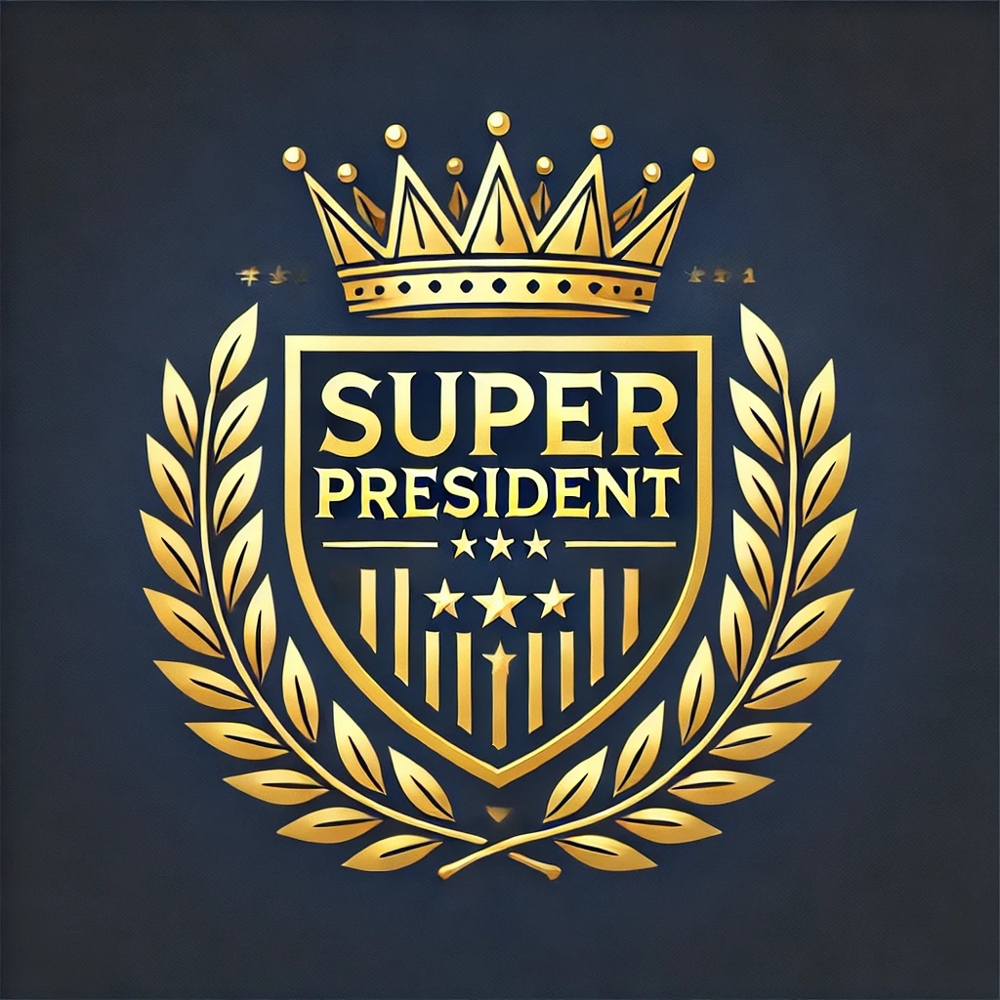

# Proposition 2 : Ludique et Dynamique
## Description Détaillée du Logo
1. Ambiance Générale

   Thème : Un logo vibrant qui communique énergie, compétition et plaisir. Il capture l’essence d’un jeu de cartes dynamique où chaque joueur vise le titre de "Super Président".
   Style Visuel : Modernité et convivialité, avec une asymétrie qui accentue le mouvement et la progression, pour transmettre le dynamisme du jeu.

2. Palette de Couleurs

   Rouge Vif (#FF0000) : Couleur dominante, utilisée pour les éléments principaux comme les cartes et les éclats d'énergie. Elle incarne la passion et l'excitation.
   Argent Métallique (#C0C0C0) : Accentue le texte et les détails, apportant une touche de sophistication avec un effet métallique pour ajouter du contraste et de la modernité.
   Noir ou Gris Foncé (#333333) : Utilisé pour les ombres et contours, renforçant les contrastes sans dominer le design.

3. Symboles et Images

   Cartes à Jouer :
   Cartes Représentées : L'As, le Roi et la Dame de cœur, emblématiques et reconnaissables.
   Position : Disposées en éventail et inclinées vers la droite sur le côté gauche du logo, suggérant un mouvement en cours.
   Design :
   Illustrations : Les figures de Roi et Dame sont stylisées de manière moderne, simplifiées pour une esthétique épurée tout en étant instantanément identifiables.
   Dos des Cartes : Possède un motif unique, soit le logo du jeu, soit des motifs géométriques subtils.
   Couleurs : Les cartes conservent leurs couleurs traditionnelles, avec des cœurs rouges vifs et des détails en argent pour harmoniser avec le texte.

4. Texte et Typographie

   Contenu : "SUPER PRÉSIDENT" en lettres majuscules, créant un impact fort et confiant.
   Police : Sans-serif moderne et dynamique, telle qu’Helvetica ou Arial, pour une allure contemporaine et accueillante.
   Effet et Inclinaison : Texte légèrement incliné vers la droite, accompagnant l'inclinaison des cartes pour un effet de progression et d'ascension.
   Couleur : Argent métallique, contrastant avec le rouge et ajoutant de la profondeur avec des reflets argentés subtils.
   Position : Placé sur le côté droit, aligné horizontalement avec les cartes, intégrant l’asymétrie de manière équilibrée.

5. Effets Visuels et Finitions

   Ombres Portées : Légères ombres sous les cartes pour ajouter une impression de profondeur et de dimension.
   Reflets Métalliques : Effet de brillance sur les éléments argentés du texte et des détails des cartes pour renforcer leur aspect moderne.
   Éclats d'Énergie : De petits éclats rouges et argent dispersés autour des cartes, apportant un effet de dynamisme et d’énergie autour du mouvement des cartes.

6. Effet de Mouvement et Lignes de Vitesse

   Lignes de Vitesse : Situées derrière les cartes, ces lignes de vitesse renforcent l’idée de mouvement dynamique, comme si les cartes étaient distribuées.
   Position : Disposées en arrière-plan des cartes, avec une légère inclinaison vers la droite pour s’harmoniser avec l’angle général du logo.

7. Composition et Asymétrie

   Disposition Asymétrique : Conception délibérément asymétrique pour renforcer la sensation de dynamisme. Les éléments s’étendent en diagonale, créant une ligne ascendante de gauche à droite.
   Alignement :
   Gauche : Cartes disposées en éventail.
   Droite : Texte "SUPER PRÉSIDENT" aligné avec les cartes et légèrement incliné.
   Chevauchement des Éléments : Les cartes chevauchent subtilement le texte, donnant un aspect de fluidité et de cohésion.

8. Dimensions et Proportions

   Forme : Orientation horizontale, plus large que haute.
   Équilibre Visuel : Bien que le logo soit asymétrique, les éléments sont équilibrés de manière à maintenir une composition harmonieuse.

9. Fond et Versions Adaptées

   Fond Blanc Uni : Pour un look clair et épuré, accentuant les couleurs vives.
   Fond Transparent : Variante pour une utilisation sur différents supports, assurant la polyvalence.

10. Détails Supplémentaires et Motifs

    Motifs sur les Cartes :
    As de Cœur : Mis en avant avec un design légèrement plus grand ou plus détaillé, symbolisant le rang élevé.
    Personnages Modernisés : Le Roi et la Dame sont représentés avec des traits simplifiés, ajoutant une touche contemporaine.
    Contour ou Ombre sur le Texte : Un contour discret ou une ombre portée autour du texte "SUPER PRÉSIDENT" permet de le détacher du fond et d’ajouter de la profondeur.
    Incrustation Métallique : Un léger effet dégradé argenté sur le texte pour une impression sophistiquée. 

En résumé, ce logo transmet une énergie compétitive et un plaisir ludique avec des éléments qui reflètent le dynamisme du jeu. Sa composition asymétrique et son inclinaison vers la droite suggèrent la progression et le challenge.

## Instructions pour DALL·E :
    Design a vibrant, energetic logo titled 'SUPER PRESIDENT' that conveys competition, excitement, and fun, suited for a dynamic card game. The logo should have a modern and welcoming style with asymmetry to emphasize movement and progression, creating a sense of energy.

    Color Palette:
    Bright Red (#FF0000): Dominant color used for main elements like playing cards and energy bursts, embodying passion and excitement.
    Metallic Silver (#C0C0C0): Accents the text and details with a sophisticated metallic sheen, adding contrast and a modern touch.
    Dark Gray or Black (#333333): Used for shadows and outlines, enhancing contrast without overpowering the design.

    Symbols and Imagery:
    Playing Cards: Featuring the Ace, King, and Queen of Hearts, with modernized, recognizable illustrations.
    Position: Arranged in a fan-like spread, tilted to the right on the left side of the logo, suggesting movement.
    Design: Simplified, modern figures for the King and Queen, with a unique card back design, either the game logo or subtle geometric patterns.
    Colors: Traditional colors with vivid red hearts and silver details for harmony with the text.

    Text and Typography:
    Content: 'SUPER PRESIDENT' in uppercase letters, creating a strong and confident impact.
    Font: A modern, dynamic sans-serif typeface like Helvetica or Arial, for a contemporary and approachable feel.
    Effect and Tilt: Slight rightward tilt, matching the card angle for a sense of progression and ascension.
    Color: Metallic silver with subtle highlights, contrasting with the red and adding depth with a faint metallic reflection.
    Position: Aligned horizontally with the cards on the right side, integrating asymmetry in a balanced manner.

    Visual Effects and Finishing Touches:
    Shadows and Depth: Subtle shadows beneath the cards to create depth and dimension.
    Metallic Reflections: A light sheen on silver elements (text and card details) to reinforce their modern look.
    Energy Bursts: Small red and silver energy bursts around the cards, enhancing the dynamic feel of the logo.

    Movement Effects and Speed Lines:
    Speed Lines: Behind the cards, angled slightly to the right, reinforcing the idea of movement as if the cards are being dealt.

    Composition and Asymmetry:
    Asymmetrical Layout: Designed with deliberate asymmetry to emphasize dynamism, forming an upward diagonal line from left to right.
    Alignment: Cards fan out on the left; text 'SUPER PRESIDENT' aligns on the right with a slight tilt.
    Overlapping Elements: Cards slightly overlap with the text, creating cohesion and fluidity.

    Dimensions and Orientation:
    Horizontal Layout: Wider than tall for a balanced, visually appealing asymmetry.

    Background and Alternate Versions:
    White Background: Clean, minimal backdrop to enhance vibrant colors.
    Transparent Background: Alternative for flexible usage on various media.

    Additional Details and Patterns:
    Card Motifs: The Ace of Hearts stands out with a slightly larger or more detailed design.
    Modernized Characters: The King and Queen feature simplified lines for a contemporary feel.
    Outline or Shadow on Text: A subtle outline or shadow around 'SUPER PRESIDENT' helps it stand out against the background, adding depth.
    Metallic Inlay: A soft silver gradient on the text to give a sophisticated impression.

## Résultat 

# Proposition 3 : Moderne et Minimaliste
## Description Détaillée du Logo 
1. Ambiance Générale

   Thème : Ce logo repose sur un design moderne et épuré, mettant en avant les initiales "SP" dans une composition graphique impactante. L’accent est mis sur l’élégance discrète, l'efficacité et la lisibilité, pour créer un symbole facilement reconnaissable et intemporel.
   Style Visuel : Un design sophistiqué et minimaliste, sans éléments superflus, privilégiant les formes géométriques simples et les contrastes de couleurs pour une esthétique épurée.

2. Palette de Couleurs

   Noir Profond (#000000) : Couleur principale pour le fond ou les éléments principaux, ajoutant de la profondeur et un aspect élégant.
   Blanc Pur (#FFFFFF) : Utilisé pour les initiales ou en fond alternatif, créant un contraste fort avec le noir pour un look chic et clair.
   Doré Métallique (#FFD700) : Des touches dorées sont ajoutées subtilement, symbolisant le luxe et la sophistication, sans alourdir le design.

3. Symboles et Images

   Initiales Stylisées "SP" :
   Design des Lettres :
   Les lettres "S" et "P" sont fusionnées ou entrelacées pour former un symbole unique, jouant sur la complémentarité de leurs formes.
   Lignes : Les lignes sont épurées, avec un design qui privilégie soit des courbes douces, soit des angles droits pour renforcer la modernité. Elles peuvent être légèrement abstraites, mais suffisamment reconnaissables pour rester identifiables.
   Position : Les initiales occupent le centre du logo, avec une dominance visuelle forte.
   Couleur : Les initiales sont en blanc pur sur un fond noir pour un contraste maximal, ou l'inverse (noir sur fond blanc) selon le support.

4. Typographie des Initiales

   Style de Police : Sans-serif moderne et épuré, avec des polices comme Futura ou Helvetica Neue pour une apparence contemporaine.
   Caractéristiques des Lettres :
   Épaisseur : Trait moyen à épais, pour une impression de solidité.
   Formes Nettes et Simples : Les lettres sont équilibrées et harmonieuses, avec un style minimaliste qui mise sur la pureté des formes.

5. Composition et Disposition

   Symétrie et Centrage : Le logo est centré, avec les initiales "SP" positionnées de manière symétrique ou équilibrée pour garantir un visuel plaisant.
   Alignement et Fusion : Les lettres peuvent être imbriquées, superposées, ou reliées par une ligne commune. Par exemple, le "S" pourrait s’inscrire dans l’espace négatif du "P" ou être encadré par une barre horizontale dorée.
   Interaction des Formes : Les initiales "SP" peuvent être intégrées dans une forme géométrique simple comme un cercle, un carré ou un rectangle, ajoutant une structure visuelle autour du logo.

6. Style et Détails

   Lignes et Contours : Lignes nettes, sans ornements ou fioritures inutiles.
   Effets Visuels :
   Minimalisme Pur : Pas d’ombres, de dégradés ou d’effets 3D. Tout est plat pour un rendu moderne.
   Accent Doré Subtil : Une ligne dorée ou un petit détail doré peut être ajouté pour accentuer le luxe sans distraire. Par exemple, une barre dorée horizontale à travers les lettres, ou un fin contour doré autour des initiales.

7. Fond et Versions Adaptées

   Option 1 : Fond Blanc : Pour une esthétique épurée, avec les initiales en noir.
   Option 2 : Fond Noir : Pour un impact visuel fort, avec les initiales en blanc.
   Option 3 : Fond Transparent : Polyvalence pour des utilisations sur divers supports.

8. Autres Éléments Graphiques

   Formes Géométriques Simples :
   Des cercles, carrés ou triangles peuvent être ajoutés pour encadrer ou accompagner les initiales "SP".
   Exemple : Les initiales pourraient être inscrites dans un cercle noir, ou partiellement entourées d’une ligne dorée.

9. Ambiance Générale

   Impression Dégagée : Le logo inspire le modernisme, la sophistication et la simplicité.
   Utilisation Prévue : Parfait pour des sites web, applications mobiles et icônes où un design simple et visuellement percutant est nécessaire. Convient également pour l’impression sur des supports physiques, tels que des cartes de visite ou des affiches.

10. Dimensions et Proportions

    Proportions Équilibrées : Le logo s’adapte bien aux formats carrés ou rectangulaires, pouvant être réduit tout en restant lisible.
    Échelle et Adaptabilité : Le design reste identifiable même en petit format, idéal pour des icônes d’application ou des favicons. 

## Instructions pour DALL·E
    Design a modern, timeless logo focusing on the initials 'SP' in a sleek and impactful style. The theme is minimalist sophistication, with an emphasis on elegance, efficiency, and readability, creating a symbol that is both recognizable and enduring.

    Color Palette:
    Deep Black (#000000): Primary color for background or main elements, adding depth and elegance.
    Pure White (#FFFFFF): Used for the initials or as an alternate background, providing strong contrast for a chic, clear look.
    Metallic Gold (#FFD700): Subtle gold accents for a touch of luxury and sophistication without overwhelming the design.

    Main Graphic Elements:
    Stylized Initials 'SP':
    Design: The letters 'S' and 'P' are either intertwined or fused to create a unique, complementary symbol.
    Lines: Clean, simple lines with either soft curves or sharp angles for a modern look. The initials may be slightly abstract but remain identifiable.
    Position: Centered, with strong visual dominance.
    Color: White initials on a black background for maximum contrast or inverted with black initials on a white background for adaptability.

    Typography of Initials:
    Font Style: Modern sans-serif, like Futura or Helvetica Neue, for a contemporary appearance.
    Letter Features: Medium to thick lines, conveying solidity and balance.
    Shape: Sharp and simple letterforms that prioritize clarity and minimalist aesthetics.

    Composition and Layout:
    Symmetry and Centering: Centralized design with balanced positioning of 'SP' for visual appeal.
    Alignment and Integration: Letters may be interlocked, overlapping, or joined by a common line; for example, the 'S' could fit within the negative space of the 'P' or be encased by a horizontal gold bar.
    Shape Interaction: 'SP' could be enclosed within a simple geometric shape like a circle, square, or rectangle, adding structure to the logo.

    Styling and Details:
    Lines and Edges: Crisp, unadorned lines with no unnecessary embellishments.
    Visual Effects: Pure minimalism—no shadows, gradients, or 3D effects, ensuring a flat, modern finish.
    Subtle Gold Accents: A gold line or small gold detail, like a horizontal bar across the initials or a thin outline around them, to hint at luxury without distraction.

    Background and Versions:
    Option 1: White Background: Clean aesthetic with black initials.
    Option 2: Black Background: Bold visual impact with white initials.
    Option 3: Transparent Background: Versatile for use across different media.

    Additional Geometric Elements:
    Simple Shapes: Optional circles, squares, or triangles to frame or complement 'SP'.
    Example: The initials might be enclosed within a black circle or partially encircled by a fine gold line.

    Overall Impression:
    Mood: Conveys modernity, sophistication, and simplicity.
    Intended Use: Suitable for websites, mobile apps, and icons that require a clean, striking design. Also ideal for physical print, like business cards or posters.

    Dimensions and Proportions:
    Balanced Proportions: Well-suited to square or rectangular formats, maintaining readability even at small sizes, ideal for app icons or favicons.

## Résultat
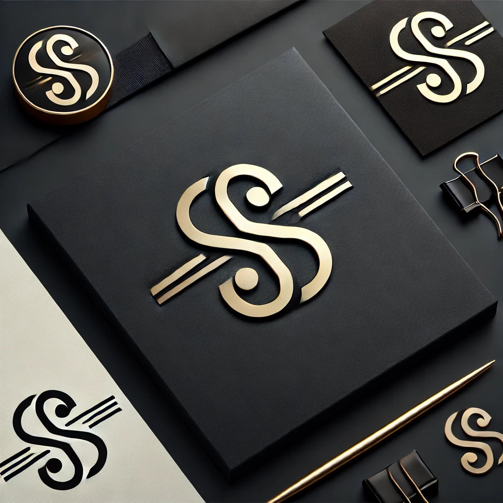

# Proposition 4 : Autorité et Pouvoir
## Description Détaillée du Logo
1. Ambiance Générale

   Thème : Le logo combine tradition et modernité pour évoquer l’autorité, le respect et la grandeur. Son design inspire un sentiment de prestige et de puissance, renforcé par des symboles classiques comme le sceptre, la couronne et les étoiles.
   Style Visuel : Les éléments sont disposés pour créer une symétrie verticale harmonieuse, renforçant la stabilité et l’équilibre du logo, tout en incorporant des détails raffinés.

2. Palette de Couleurs

   Noir Profond (#000000) : Utilisé pour le fond ou certains éléments, cette couleur ajoute une touche de sophistication et un contraste fort avec l’or.
   Or Métallique (#FFD700) : Couleur principale pour les symboles (couronne, sceptre, laurier), évoquant le prestige et le luxe.
   Blanc Pur (#FFFFFF) : Utilisé pour le texte et certains détails pour apporter de la clarté et pour contraster avec le noir et l’or.

3. Symboles et Images

   Sceptre et Couronne Croisés :
   Position : Placés au centre, les deux symboles se croisent en "X", ajoutant un effet de majesté et de solennité.
   Design du Sceptre : Un sceptre doré, orné de détails fins avec un sommet décoratif, tel un globe ou un emblème, ajoutant du raffinement.
   Design de la Couronne : Couronne dorée traditionnelle avec des pointes ornées de joyaux ou de motifs floraux stylisés, inspirant la royauté.

   Blason (Écusson) :
   Forme : Un écusson classique en forme de bouclier, positionné derrière les symboles croisés.
   Fond du Blason : Noir profond pour contraster nettement avec les symboles dorés.
   Bordure : Une bordure épaisse en or qui entoure le blason, ajoutant une touche de sophistication et attirant l'œil vers le centre.

   Couronne de Laurier Dorée :
   Position : Entoure l’écusson et les symboles croisés, formant un cercle de prestige et de succès.
   Design : Les feuilles de laurier sont détaillées, stylisées pour apporter une apparence réaliste mais épurée, symbolisant la victoire et l’honneur.

   Étoiles Dorées :
   Nombre : Cinq étoiles dorées.
   Position : Alignées en arc au-dessus du blason ou en demi-cercle sous le texte, ajoutant de l’équilibre à la composition.
   Design : Étoiles à cinq branches avec un relief léger pour renforcer l’aspect tridimensionnel.

4. Texte et Typographie

   Contenu : "Super Président" en lettres majuscules ou avec la première lettre de chaque mot en majuscule.
   Police de Caractère :
   Style : Manuscrite élégante, comme Lucida Calligraphy ou Edwardian Script, pour une touche classique et prestigieuse.
   Caractéristiques : Lettres inclinées avec des boucles gracieuses, dégageant sophistication et tradition.
   Position : Centré sous le blason, légèrement superposé à la base de la couronne de laurier pour une intégration fluide.
   Couleur : Blanc pur ou or métallique selon le fond pour assurer une lisibilité optimale.

5. Composition et Disposition

   Symétrie Verticale : Le logo est parfaitement symétrique, avec les éléments principaux alignés pour créer un équilibre et une harmonie visuelle.
   Alignement Vertical :
   En Haut : Les étoiles dorées en arc.
   Au Centre : Le blason noir avec le sceptre et la couronne croisés.
   Autour : La couronne de laurier dorée entourant le blason et les symboles.
   En Bas : Le texte "Super Président" dans une police manuscrite, ajoutant de l’élégance.

6. Style et Détails

   Lignes et Contours : Lignes nettes et détails élaborés pour chaque symbole, avec des contours précis.
   Effets Visuels :
   Relief et Ombres : Des ombres subtiles et des effets de relief apportent de la profondeur aux éléments dorés.
   Brillance Métallique : Légers reflets dorés pour simuler l’éclat du métal précieux, sans effet clinquant.
   Fond :
   Option 1 : Fond Noir Profond : Fait ressortir les éléments dorés et le texte blanc, créant un contraste saisissant.
   Option 2 : Fond Transparent : Permet une utilisation flexible sur divers supports.

7. Autres Éléments et Détails Supplémentaires

   Ornements Traditionnels : Des motifs floraux ou arabesques subtils peuvent être intégrés autour du blason, ou sur les symboles du sceptre et de la couronne pour enrichir le design.
   Bannière : Une bannière dorée ou blanche sous le texte pourrait porter une devise ou un slogan, ajoutant un détail supplémentaire de prestige.

8. Ambiance Générale

   Impression Dégagée : Ce logo inspire le respect, le pouvoir et l’élégance. Il est conçu pour évoquer la grandeur du rôle de "Super Président" et la souveraineté du jeu.
   Utilisation Prévue : Convient parfaitement pour le site web du jeu, les écrans de chargement, les supports marketing et tout support nécessitant une représentation forte du jeu.

9. Dimensions et Proportions

   Proportions : Le logo est plus haut que large, avec une orientation verticale qui accentue l’aspect majestueux.
   Équilibre Visuel : Les éléments sont placés harmonieusement pour un équilibre esthétique, créant une composition cohérente.

10. Typographie Additionnelle et Effets de Texte

    Contour ou Ombre Portée : Un contour ou une ombre légère pourrait être appliqué au texte pour le détacher du fond.
    Incrustation Dorée : Un effet de texture ou de dégradé doré pourrait être appliqué au texte pour le lier visuellement aux autres éléments dorés.

11. Détails Additionnels :

    Intégration Artistique : Le sceptre et la couronne sont entrelacés de manière à créer une symétrie harmonieuse.
    Ornementation des Étoiles : Les étoiles pourraient être doublées d'un contour ou avoir des motifs internes subtils pour enrichir leur apparence.

## Instructions pour DALL·E :
    Design an elegant, authoritative logo for 'Super Président,' combining tradition and modernity to evoke respect, power, and grandeur. The logo should convey prestige through a vertically symmetrical composition with classic symbols, detailed craftsmanship, and a sophisticated color scheme.

    Color Palette:
    Deep Black (#000000): Background or for select elements to add depth and sophistication, contrasting with the gold.
    Metallic Gold (#FFD700): Primary color for key symbols (crown, scepter, laurel wreath) to evoke luxury and prominence.
    Pure White (#FFFFFF): Used for text or specific details to bring clarity and balance, contrasting against the black and gold.

    Main Symbols and Imagery:
    Crossed Scepter and Crown:
    Position: Centered, with the scepter and crown crossing in an 'X' shape, adding majesty and solemnity.
    Scepter Design: Gold with refined details and a decorative top, such as a globe or emblem, to exude elegance.
    Crown Design: Traditional gold crown with spiked points and stylized embellishments, symbolizing royalty and authority.
    Shield (Blason):
    Shape: Classic shield form positioned behind the crossed symbols.
    Background: Deep black for sharp contrast with gold symbols.
    Border: Thick gold border surrounding the shield, adding sophistication and drawing focus to the center.
    Golden Laurel Wreath:
    Position: Encircling the shield and crossed symbols in a circular arrangement to signify prestige and honor.
    Design: Realistic yet stylized laurel leaves, detailed but clean, symbolizing victory and respect.

    Stars:
    Number: Five stars in metallic gold.
    Position: Arranged in an arc above the shield or in a semicircle below the text, balancing the overall composition.
    Design: Five-pointed stars with subtle relief for a slight 3D effect.

    Text and Typography:
    Content: 'Super Président' in uppercase or title case.
    Font Style: Elegant script font like Lucida Calligraphy or Edwardian Script for a classic, prestigious look.
    Letter Features: Slanted letters with graceful curves for a touch of sophistication.
    Position: Centered below the shield, slightly overlapping the base of the laurel wreath for seamless integration.
    Color: White or metallic gold, depending on background, ensuring optimal readability.

    Composition and Layout:
    Vertical Symmetry: Perfect vertical symmetry with key elements aligned for visual harmony and balance.
    Element Arrangement:
    Top: Gold stars in an arc.
    Center: Black shield with crossed scepter and crown.
    Surrounding: Golden laurel wreath framing the shield.
    Bottom: 'Super Président' text in elegant script, adding a refined touch.

    Styling and Visual Effects:
    Lines and Contours: Sharp, clean lines with intricate detail for each symbol.
    Subtle Shadows and Relief: Light shadowing and relief on gold elements (crown, scepter, laurel wreath) to provide depth.
    Metallic Shine: Subtle golden highlights to simulate the gleam of precious metal without being flashy.
    Background Options:
    Option 1: Deep black background for striking contrast with gold elements and white text.
    Option 2: Transparent background for versatile use.

    Additional Details and Traditional Embellishments:
    Ornate Motifs: Optional floral or arabesque motifs around the shield or on the scepter and crown for a touch of classical refinement.
    Banner: Optional gold or white banner beneath the text for a motto or slogan, enhancing the prestigious feel.

    General Mood and Usage:
    Mood: Inspires respect, power, and elegance, suited to convey the grandeur of the 'Super Président' title.
    Intended Use: Perfect for game websites, loading screens, marketing materials, and any media where a strong representation of the game is needed.

    Proportions and Adaptability:
    Vertical Proportion: Taller than it is wide for a majestic, vertical orientation.
    Balanced Layout: Elements are harmoniously arranged for aesthetic coherence, making the logo visually appealing at any scale.

    Text and Additional Effects:

    Text Outline or Drop Shadow: Light outline or shadow around the text to enhance legibility against varied backgrounds.
    Gold Inlay: Slight gradient or textured gold effect on the text to visually link it to other gold elements.

    This logo design is meant to communicate authority and prestige with a timeless appeal, ideal for both digital and physical formats, emphasizing the dignified role of 'Super Président.'

## Résultat
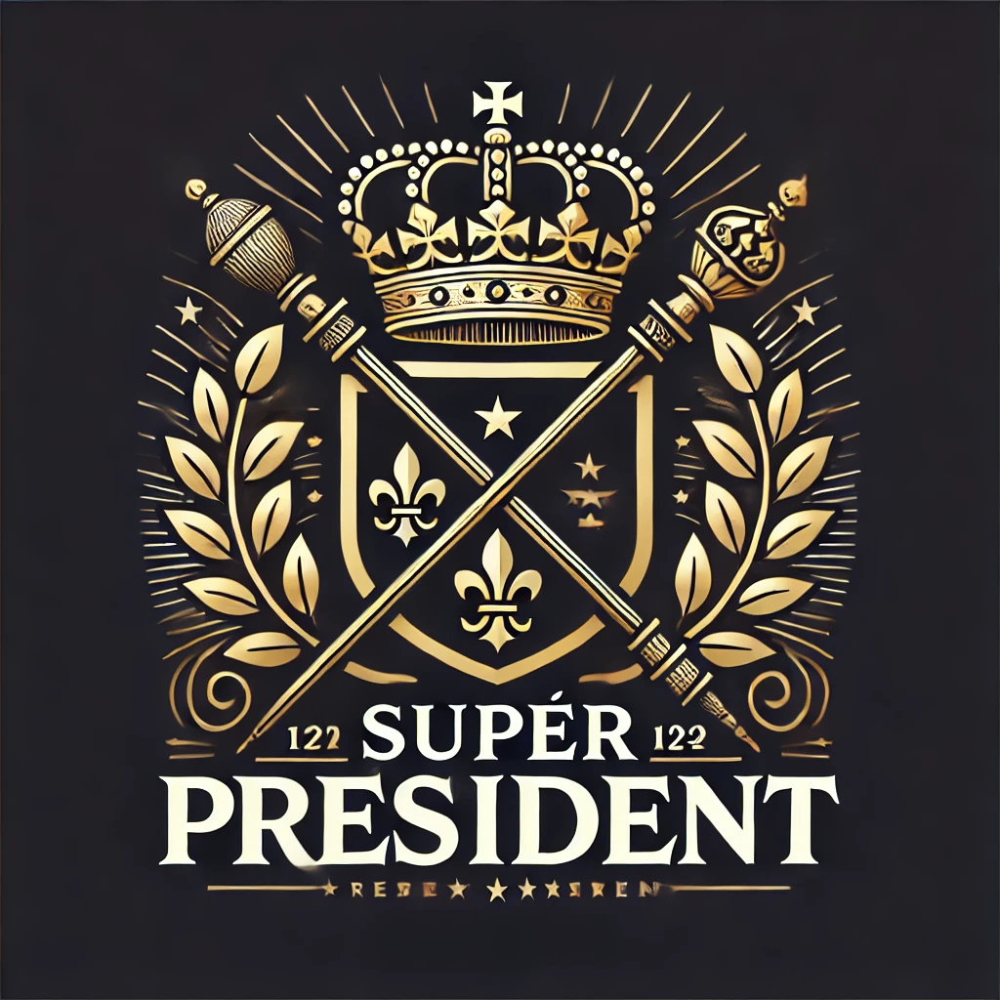

# Proposition A : Les Quatre Symboles des Cartes
## Description Détaillée du Logo
1. Ambiance Générale

   Thème : Le logo met en avant les symboles emblématiques des cartes à jouer — Cœur, Carreau, Trèfle et Pique — pour représenter les quatre joueurs minimum du jeu de Président. L’ambiance est à la fois conviviale et reconnaissable, évoquant le monde des jeux de cartes de manière accessible et universelle.
   Style Visuel : Moderne et épuré, avec des lignes nettes et des symboles stylisés pour donner un aspect frais, élégant et sophistiqué, tout en conservant une touche de prestige.

2. Palette de Couleurs

   Rouge Vif (#FF0000) : Utilisé pour les symboles du Cœur et du Carreau, ajoutant chaleur et énergie.
   Noir Profond (#000000) : Employé pour les symboles du Trèfle et du Pique, renforçant le contraste et l’aspect traditionnel.
   Blanc Pur (#FFFFFF) : Utilisé comme couleur de fond ou pour contraster certains éléments pour une meilleure lisibilité.
   Doré Métallique (#FFD700) : Appliqué subtilement pour des détails prestigieux, notamment sur le texte ou les contours des symboles, renforçant le caractère haut de gamme.

3. Symboles et Images

   Les Quatre Symboles (Cœur, Carreau, Trèfle, Pique) :
   Disposition :
   Option 1 : Les symboles forment un cercle autour du nom "Super Président", créant un effet de rassemblement et de symétrie.
   Option 2 : Les symboles sont disposés aux quatre coins d’un carré imaginaire, offrant un équilibre visuel et structurant le centre pour le texte.
   Design : Les symboles sont stylisés et épurés, avec des lignes nettes pour une reconnaissance immédiate. Ils conservent leurs formes traditionnelles, mais avec une modernité qui les rend visuellement attractifs.
   Effets : Les symboles bénéficient d’un léger relief ou d’ombres portées, apportant de la profondeur sans compromettre la simplicité.

   Intégration du Nom ("Super Président") :
   Position :
   Option 1 : Au centre des quatre symboles, attirant immédiatement le regard.
   Option 2 : Placé en dessous de la disposition en cercle ou carré formée par les symboles, pour un style plus minimaliste.
   Style du Texte : En lettres majuscules pour une lisibilité optimale, avec une police sans-serif moderne, telle que Helvetica ou Arial, ajoutant une touche contemporaine.
   Couleur : Doré métallique pour un contraste élégant avec les symboles rouges et noirs.

4. Composition et Disposition

   Symétrie et Équilibre : Le logo est symétrique, créant une harmonie visuelle. La disposition circulaire ou en carré des symboles assure un équilibre parfait autour du texte central, donnant un aspect ordonné et agréable à regarder.
   Alignement :
   Cercle : Les symboles sont disposés en cercle autour du texte, créant une composition accueillante.
   Carré : Les symboles sont placés aux quatre coins d’un carré imaginaire, avec le texte "Super Président" au centre, offrant une présentation structurée et équilibrée.

5. Style et Détails

   Lignes et Contours : Lignes nettes et précises, avec un aspect moderne. Les contours des symboles sont bien définis pour assurer une reconnaissance immédiate.
   Effets Visuels :
   Relief Subtil : Les symboles peuvent avoir un effet 3D léger pour donner du relief sans distraire de la simplicité globale du design.
   Ombres Portées : Des ombres discrètes ajoutent de la profondeur, accentuant l’aspect raffiné du logo.

6. Fond et Versions Adaptées

   Fond Blanc : Pour un look clair, épuré et contemporain, parfait pour des supports numériques et imprimés.
   Fond Transparent : Version alternative pour une utilisation polyvalente sur différents arrière-plans, assurant la flexibilité du logo.

7. Ambiance Générale

   Impression Dégagée : Le logo évoque immédiatement l’univers des jeux de cartes, avec une simplicité qui le rend accueillant et familier pour tous les joueurs, quels que soient leur âge et leur niveau.
   Utilisation Prévue : Idéal pour les sites web, applications mobiles, supports marketing et autres supports nécessitant un logo simple mais impactant, représentatif de l’essence du jeu de cartes.

8. Dimensions et Proportions

   Proportions : Le logo a une structure équilibrée, s’adaptant bien aux formats carrés ou circulaires. Sa simplicité le rend également idéal pour des tailles réduites, comme les icônes d’application.
   Échelle et Adaptabilité : Le design reste clair et facilement identifiable même en petite taille, offrant une flexibilité maximale pour différents supports.

## Instructions pour DALL·E :
    Design a refined and modern logo for 'Super Président,' inspired by classic playing card symbols—Heart, Diamond, Club, and Spade—representing the four players of the card game. The logo should be welcoming and instantly recognizable, evoking the world of card games in an accessible yet sophisticated manner.
    
    Color Palette:
    Bright Red (#FF0000): For the Heart and Diamond symbols, adding warmth and energy.
    Deep Black (#000000): Used for the Club and Spade symbols, emphasizing contrast and tradition.
    Pure White (#FFFFFF): Background color or used as accents to enhance readability.
    Metallic Gold (#FFD700): Subtle gold detailing, especially on text or symbol outlines, to add a touch of luxury and elegance.
    
    Main Symbols and Imagery:
    Four Card Symbols (Heart, Diamond, Club, Spade):
    Arrangement Options:
    Option 1: Symbols are arranged in a circle around the name "Super Président," creating a sense of unity and symmetry.
    Option 2: Symbols are positioned at the four corners of an imaginary square, framing the central text and offering visual balance.
    Design: Clean, stylized symbols with precise lines for immediate recognition, modernized for a visually appealing effect.
    Effects: Subtle relief or drop shadows for depth, adding sophistication without disrupting the clean design.
    
    Text Integration ("Super Président"):
    Position:
    Option 1: Centered among the four symbols, drawing immediate attention.
    Option 2: Below the circular or square arrangement of symbols for a minimalist touch.
    Text Style: Uppercase letters for clarity and impact, using a modern sans-serif font like Helvetica or Arial for a contemporary look.
    Color: Metallic gold, contrasting elegantly with the red and black symbols.
    
    Composition and Balance:
    Symmetry and Balance: Perfectly symmetrical, creating visual harmony. Circular or square symbol arrangements ensure an orderly, aesthetically pleasing composition around the central text.
    Alignment:
    Circular Arrangement: Symbols encircle the text, forming an inviting and balanced composition.
    Square Arrangement: Symbols occupy the four corners, with "Super Président" text centered, for a structured and balanced look.
    
    Styling and Visual Details:
    Lines and Contours: Crisp, well-defined lines with a modern aesthetic; contours on the symbols are clear for instant recognition.
    Visual Effects:
    Subtle 3D Relief: Symbols feature a slight 3D effect to add depth without overpowering the simplicity.
    Soft Shadows: Discreet shadows enhance the refined look, adding depth and sophistication.
    
    Background and Adaptable Versions:
    White Background: Clean and modern, ideal for digital and print use.
    Transparent Background: Alternative for versatile usage on various media, ensuring logo flexibility.
    
    Overall Vibe and Usage:
    Mood: Instantly evokes the world of card games, with a design that is welcoming and familiar to all players, regardless of age or skill level.
    Intended Use: Ideal for websites, mobile apps, marketing materials, and other media requiring a simple yet impactful logo representative of the card game.
    
    Dimensions and Proportions:
    Proportional Balance: The logo fits well within square or circular formats, with simplicity allowing for excellent legibility in small sizes, perfect for icons and application favicons.
    Scalability: The clean, balanced design maintains clarity and recognizability even when scaled down.

    This logo is intended to capture the friendly and universal appeal of card games with an elegant, balanced layout. Its simplicity and symmetry make it timeless and versatile, perfectly suited to represent the world of card games in an accessible, yet high-quality style.

## Résultat
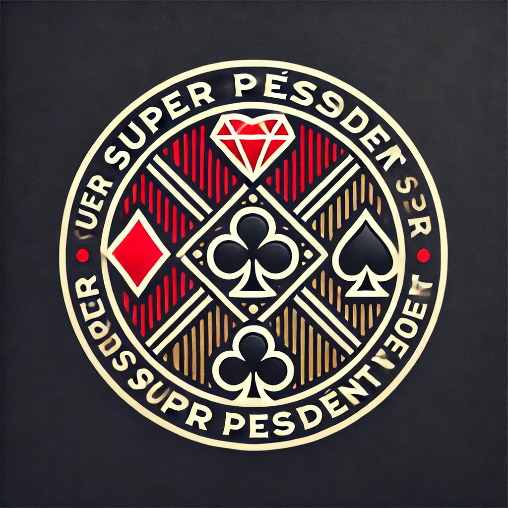
   
# Proposition B : La Table de Jeu
## Description Détaillée du Logo
1. Ambiance Générale

   Thème : Ce logo s’inspire d’une table de jeu vue de dessus, suggérant un jeu de Président en cours. Il incarne la convivialité et la stratégie, rappelant l’ambiance d’un rassemblement entre amis autour d’une partie de cartes.
   Style Visuel : Réaliste mais stylisé, avec des textures et des couleurs qui rappellent une table de casino ou de jeu classique.

2. Palette de Couleurs

   Vert Foncé (#006400) : Utilisé pour le tapis de jeu, rappelant les tables de jeux traditionnelles et créant un fond riche et immersif.
   Marron Bois (#8B4513) : Pour la table elle-même, ajoutant une texture naturelle et authentique au design.
   Rouge et Noir : Utilisé pour les cartes à jouer, apportant un contraste classique avec le vert du tapis.
   Blanc : Pour le texte et certains détails, apportant du contraste et de la lisibilité.

3. Symboles et Images

   Table de Jeu :
   Forme : Circulaire ou octogonale, évoquant la convivialité d’un jeu où plusieurs joueurs sont assis autour.
   Design : Vue de dessus avec une légère inclinaison pour donner une perspective et un effet de profondeur. Le bord de la table est visible, encadrant la scène de jeu.

   Cartes à Jouer :
   Disposition : Cartes placées autour de la table, certaines face visible et d'autres face cachée, pour illustrer le déroulement d’une partie.
   Design : Les cartes montrent des valeurs variées, y compris des cartes clés du jeu comme le 2 ou le 3.
   Dos des Cartes : Personnalisé avec un motif unique, éventuellement le logo du jeu pour renforcer l’identité visuelle.

   Mains Stylisées (Optionnel) :
   Représentation : Des mains simplifiées peuvent être incluses pour symboliser les joueurs en train de manipuler les cartes, apportant une dimension humaine au logo sans le surcharger.

   Texte ("Super Président") :
   Position : Inscrit au centre du tapis de jeu, attirant l’attention sur le nom du jeu.
   Style : Police sans-serif moderne, en lettres majuscules pour une lisibilité optimale, en blanc ou doré pour contraster avec le vert du tapis.

4. Composition et Disposition

   Perspective : Une légère inclinaison de la vue ajoute de la profondeur et donne l’impression d’une vraie table de jeu en trois dimensions.
   Éléments Centraux :
   La table est le point central, avec les cartes disposées autour et le texte au centre pour un effet de focus naturel.

5. Style et Détails

   Textures :
   Tapis de Jeu : Effet feutré pour un aspect réaliste qui rappelle les tables de casino.
   Table en Bois : Texture boisée avec des veines subtiles, accentuant l’authenticité et le réalisme.
   Effets Visuels :
   Ombres et Lumières : Subtiles ombres portées et reflets lumineux pour accentuer la profondeur, notamment autour des cartes et des bords de la table, créant un effet de réalisme sans distraire de la simplicité générale.

6. Ambiance Générale

   Impression Dégagée : Le logo invite à rejoindre la partie, évoquant le plaisir de jouer en groupe et l’atmosphère amicale et détendue d’un jeu de cartes entre amis.
   Utilisation Prévue : Ce design est idéal pour les sites web, applications mobiles, et supports marketing où l’on souhaite recréer l’ambiance immersive et accueillante d’une partie de cartes.

7. Ce logo, inspiré par la convivialité et l’interaction autour d’une table de jeu, crée une atmosphère engageante et immersive, parfaite pour représenter l’essence du jeu de Président.

## Instructions pour DALL·E :
    Create a logo for 'Super Président' that captures the immersive, friendly atmosphere of a card game in progress, viewed from above as if around a game table. The logo should evoke the ambiance of a traditional card game setting, combining realism with stylized elements and textures.
    
    Color Palette:
    Dark Green (#006400): Used for the felt playing surface, reminiscent of classic gaming tables, creating a rich and immersive background.
    Wood Brown (#8B4513): For the table’s edge, adding a natural and authentic wood texture.
    Red and Black: Used for playing card details, providing a classic contrast with the green felt.
    White: For the text and specific details, enhancing readability and contrast.
    
    Main Symbols and Imagery:
    Game Table:
    Shape: Circular or octagonal, suggesting the social aspect of players gathered around.
    Design: Top-down view with a slight tilt for perspective and depth, with the table edge visible to frame the gaming scene.
    Playing Cards:
    Placement: Cards scattered around the table, some face-up and others face-down, representing an ongoing game.
    Design: Showing key cards, such as 2 and 3, along with other varied values for authenticity.
    Back of Cards: Customized with a unique pattern, possibly incorporating the game’s logo to enhance brand identity.
    Stylized Hands (Optional):
    Representation: Simplified hands may be included to depict players handling the cards, adding a human element without overcrowding the design.
    
    Text ('Super Président'):
    Position: Placed at the center of the felt, drawing immediate attention to the game’s name.
    Font Style: Modern sans-serif in uppercase for optimal readability.
    Color: White or metallic gold to contrast with the green felt.
    
    Composition and Depth:
    Perspective: Slightly tilted top-down view for a 3D effect, enhancing the impression of an authentic gaming table.
    Central Focus: The table is the focal point, with cards positioned around and the game name centered for natural emphasis.
    
    Styling and Visual Effects:
    Textures:
    Felt Surface: Subtle felt texture for a realistic casino table appearance.
    Wood Grain: Slight wood grain detailing for the table edge, adding to the authentic feel.
    Shadows and Lighting: Soft shadows and light reflections, especially around the cards and table edges, to create a realistic depth without distracting from the clean design.
    
    Overall Mood and Usage:
    Atmosphere: Invites viewers to join the game, evoking the pleasure of a friendly gathering and the familiar ambiance of a card game.
    Intended Use: Ideal for websites, mobile apps, and marketing materials where a welcoming, immersive card-playing theme is desired.
    
    This logo combines the warmth and interaction of a card game with friends, inviting players to experience the world of 'Super Président' in a realistic yet polished design.

## Résultat
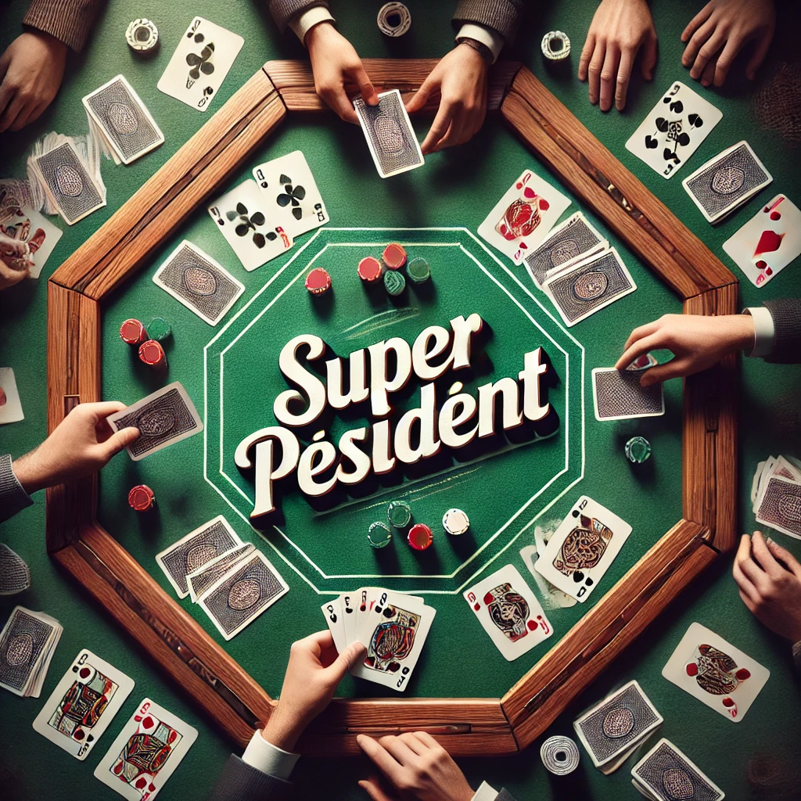

# Proposition C : Les Cartes en Éventail (Favori)
## Description Détaillée du Logo
1. Ambiance Générale

   Thème : Le logo met en avant un éventail de cartes tenu par une main stylisée, symbolisant la maîtrise et l’interaction dans le jeu de Président. L’objectif est de représenter la stratégie et la convivialité du jeu, en mettant en avant le geste emblématique d’une main tenant les cartes.
   Style Visuel : Moderne avec une touche de réalisme, utilisant des lignes nettes et des couleurs vives pour attirer l’œil et rendre le design facilement reconnaissable.

2. Palette de Couleurs

   Rouge Vif (#FF0000) : Utilisé pour les symboles de Cœur et de Carreau, apportant de la chaleur et de l’énergie au design.
   Noir Profond (#000000) : Couleur pour les symboles de Trèfle et de Pique, créant un contraste classique avec le rouge.
   Blanc Pur (#FFFFFF) : Couleur de fond ou pour les éléments contrastants, assurant une clarté et une lisibilité optimales.
   Peau Neutre : Teinte neutre ou stylisée pour la main, assurant un rendu inclusif et universel.

3. Symboles et Images

   Main Stylisée :
   Design : La main est dessinée de manière simple et stylisée, avec des contours nets et une absence de détails complexes, pour ne pas distraire de l’élément central : l’éventail de cartes.
   Position : Située sur le côté gauche ou au centre inférieur du logo, elle tient l’éventail de cartes de manière naturelle et légèrement inclinée.

   Éventail de Cartes :
   Cartes Représentées : L’éventail inclut des cartes significatives du jeu Président, comme le 2, le 3, et l’As, pour faire écho aux stratégies de ce jeu.
   Disposition : Les cartes sont étalées en éventail avec les faces avant visibles, permettant de voir les valeurs et les symboles distinctifs.
   Design des Cartes : Les cartes sont stylisées mais restent fidèles aux symboles classiques de Cœur, Carreau, Trèfle et Pique, avec des formes claires et facilement identifiables.

   Texte ("Super Président") :
   Position : Situé au-dessus de l’éventail ou à droite, assurant une lecture naturelle.
   Style du Texte : Police sans-serif moderne en majuscules pour une bonne lisibilité, comme Helvetica ou Arial.
   Couleur : Noir ou rouge vif, selon le fond, pour garantir un bon contraste et assurer que le texte soit percutant.

4. Composition et Disposition

   Orientation Horizontale : Le logo adopte une orientation principalement horizontale, avec l’éventail de cartes et le texte alignés pour un équilibre visuel fluide.
   Équilibre Visuel : L’éventail de cartes constitue le point focal, équilibré par le texte du nom du jeu à proximité pour une lecture facile.

5. Style et Détails

   Lignes et Contours : Contours propres et clairs, avec un style légèrement cartoon ou semi-réaliste pour la main et les cartes, ajoutant du caractère sans surcharger le design.
   Effets Visuels :
   Ombres Légères : Pour donner du relief aux cartes et à la main, créant un effet de profondeur.
   Couleurs Vives : Les couleurs intenses, notamment le rouge vif pour les Cœurs et Carreaux, rendent le logo visuellement attractif et mémorable.

6. Fond et Versions Adaptées

   Fond Blanc : Pour un look propre et moderne qui permet de mettre en valeur les couleurs vives et les symboles de jeu.
   Fond Transparent : Option alternative pour garantir une polyvalence sur divers supports et contextes, tels que des fonds colorés ou imprimés.

7. Ambiance Générale

   Impression Dégagée : Le logo doit évoquer la stratégie, la maîtrise du jeu, et l’interaction entre les joueurs, mettant en avant un aspect dynamique et engageant. Il donne l’impression de prendre part activement au jeu et de maîtriser les cartes en main.
   Utilisation Prévue : Convient aux supports numériques comme les sites web et applications mobiles, ainsi qu’aux supports imprimés pour des événements et promotions liés au jeu.

Ce logo avec l’éventail de cartes en main est idéal pour représenter la dimension interactive et stratégique du jeu "Super Président". Son design simple mais impactant capte l’essence du jeu de cartes tout en restant élégant et accessible.

## Instructions pour DALL·E :
    Design a logo for 'Super Président' featuring a stylized hand holding a fan of playing cards, symbolizing mastery and interaction in the game. The design should evoke strategy and camaraderie, capturing the iconic gesture of holding cards with a modern, eye-catching style.

    Color Palette:
        Bright Red (#FF0000): For Heart and Diamond symbols, adding warmth and energy.
        Deep Black (#000000): For Club and Spade symbols, creating a classic contrast with the red.
        Pure White (#FFFFFF): Used for the background or contrasting elements for maximum clarity.
        Neutral Skin Tone: For the hand, represented in a universally inclusive, stylized shade.

    Main Symbols and Imagery:
        Stylized Hand:
            Design: Simplified and stylized with clean outlines, avoiding intricate details to keep focus on the cards.
            Position: Placed on the left side or lower center, holding the fan of cards naturally with a slight tilt.
        Fan of Cards:
            Cards Displayed: The fan includes significant cards in the game of Président, such as the 2, 3, and Ace, emphasizing the strategic element.
            Arrangement: Cards are fanned out with faces showing, displaying distinct values and traditional symbols.
            Design: Cards are stylized but retain classic Heart, Diamond, Club, and Spade shapes, with crisp, easily identifiable forms.

    Text ("Super Président"):
        Position: Placed above the fan of cards or to the right for natural readability.
        Font Style: Modern sans-serif in uppercase, like Helvetica or Arial, for optimal clarity.
        Color: Black or bright red, depending on background, ensuring a strong contrast and impactful presence.

    Composition and Layout:
        Horizontal Orientation: Primarily horizontal with the card fan and text aligned for a smooth visual balance.
        Visual Balance: The card fan serves as the focal point, balanced by the game title text for easy readability.

    Styling and Visual Details:
        Lines and Contours: Clean, clear outlines with a slightly cartoonish or semi-realistic style for the hand and cards, adding character without overwhelming the design.
        Visual Effects:
            Subtle Shadows: Soft shading for the hand and cards to create depth.
            Vibrant Colors: Bold colors, especially red for Hearts and Diamonds, making the logo visually appealing and memorable.

    Background and Alternative Versions:
        White Background: Clean and modern look that highlights the bright colors and card symbols.
        Transparent Background: Alternative version for flexibility across different media and backgrounds.

    Overall Mood and Usage:
        Atmosphere: Evokes strategy, control, and interaction, inviting players to actively engage in the game.
        Intended Use: Suitable for digital media such as websites and mobile apps, as well as print materials for events and promotions.

    This logo captures the interactive and strategic essence of 'Super Président,' presenting a simple yet impactful design that embodies the elegance and accessibility of card games.

## Résultat
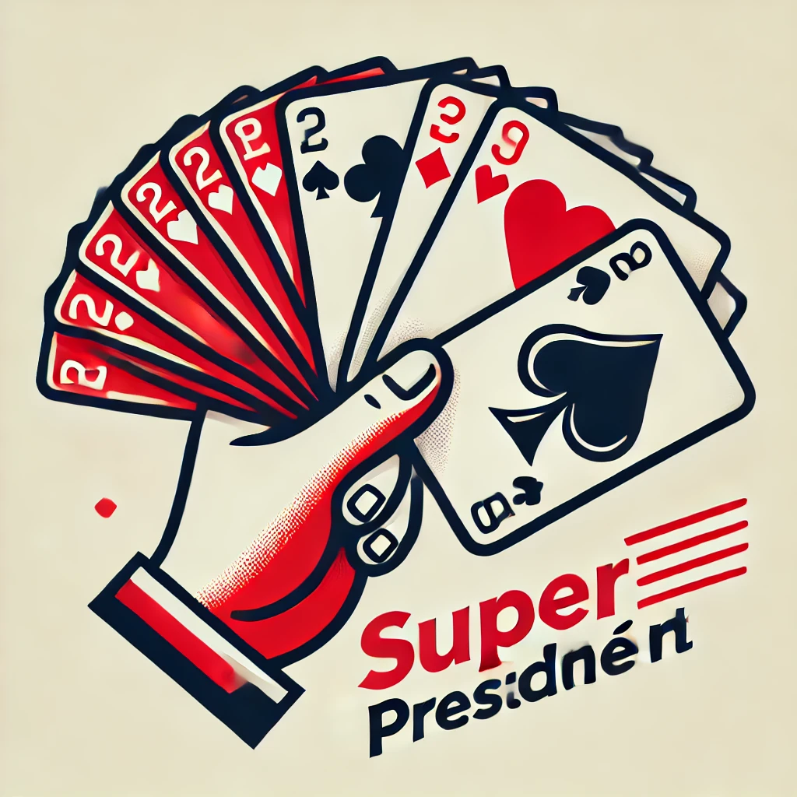
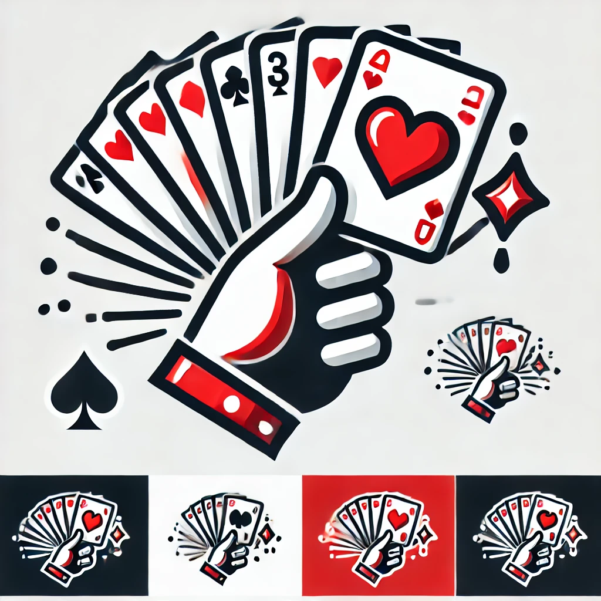
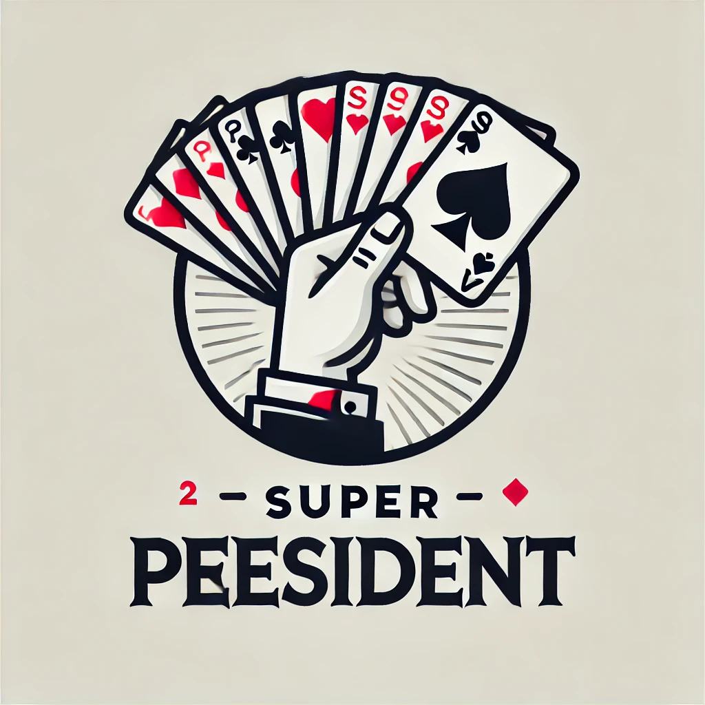
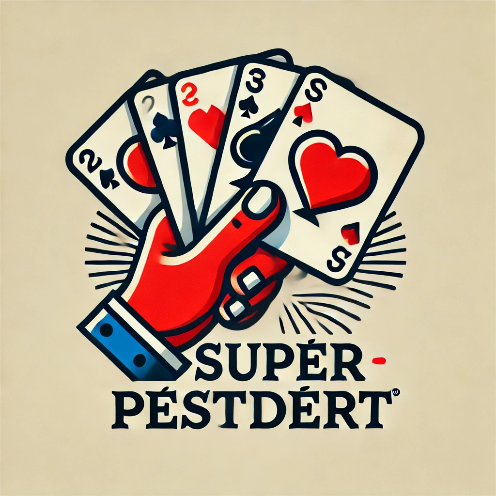
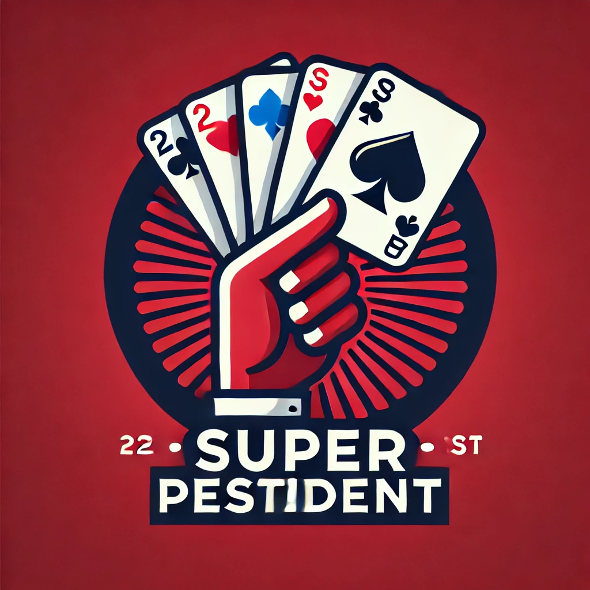
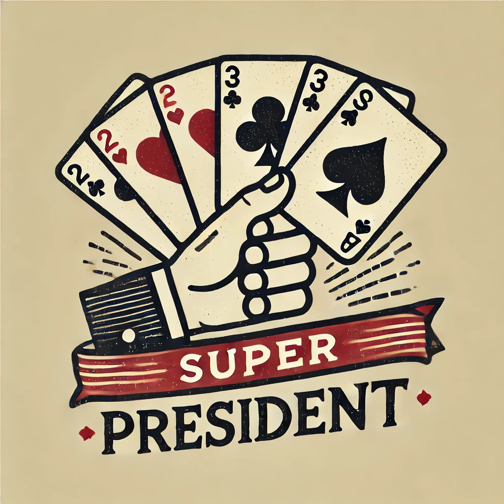
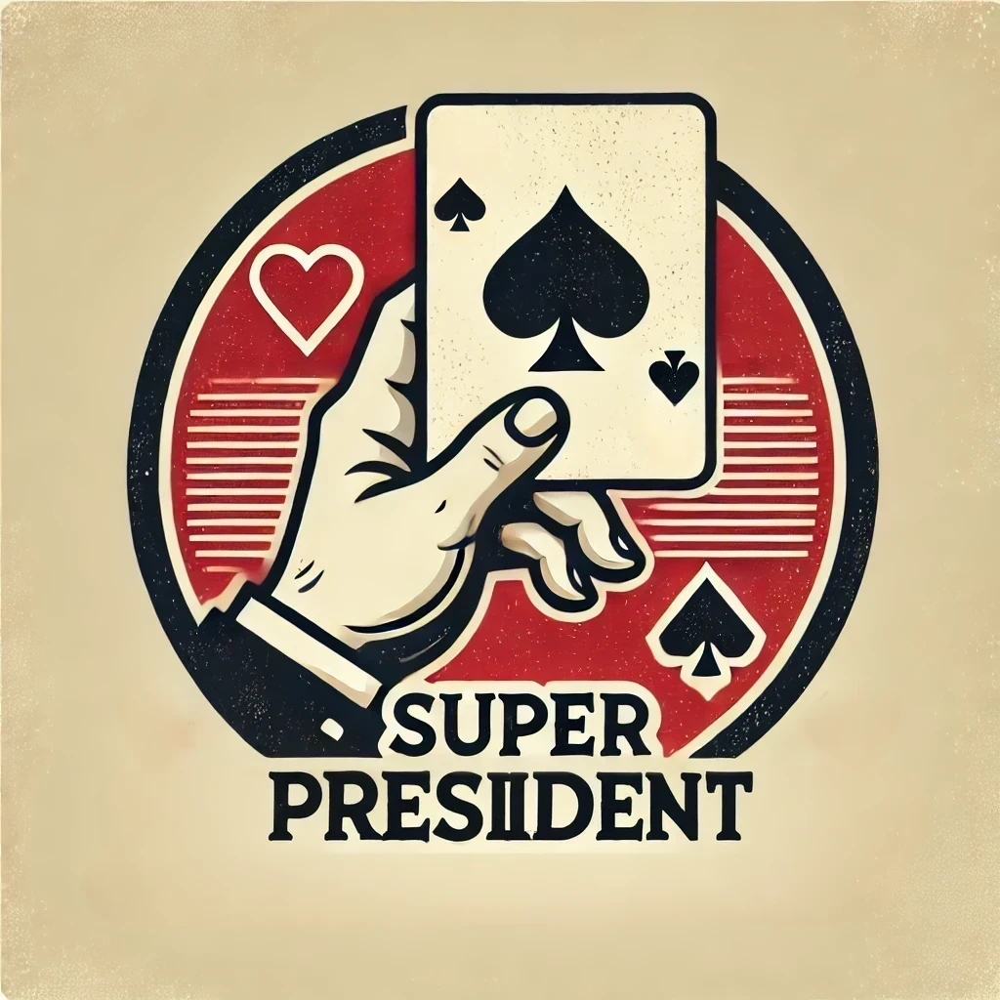

# Proposition D : Les Rangs des Joueurs
## Description Détaillée du Logo
1. Ambiance Générale

   Thème : Le logo représente la hiérarchie des joueurs dans le jeu de Président à travers une pyramide de cartes. Cette pyramide symbolise la progression et la compétition, de la base jusqu’au sommet, où les meilleurs joueurs atteignent le rang de Président.
   Style Visuel : Épuré et structuré, avec une symétrie qui accentue l’aspect hiérarchique. L’utilisation de dégradés et de détails bien définis renforce la notion de progression vers le haut.

2. Palette de Couleurs

   Dégradé de Gris Clair (#D3D3D3) à Doré Métallique (#FFD700) : Le dégradé commence avec un gris clair à la base de la pyramide, symbolisant les rangs inférieurs, et se termine en doré au sommet, représentant le Président.
   Blanc et Noir : Utilisés pour les contours et les détails pour assurer un contraste optimal.

3. Symboles et Images

   Pyramide de Cartes :
   Structure :
   La pyramide est composée de plusieurs niveaux de cartes, avec le nombre de cartes qui diminue à chaque niveau supérieur, créant une forme triangulaire.
   La base symbolise les joueurs de rang inférieur, tandis que le sommet représente le Président.
   Design des Cartes :
   Les cartes de chaque rang peuvent être marquées par des symboles ou numéros associés au jeu, comme un 2 en bas pour représenter le Trouduc et un As en haut pour le Président, renforçant ainsi le thème de la hiérarchie.
   Les cartes au sommet sont en doré, pour les différencier et souligner leur importance, tandis que les cartes de la base sont grisées.
   Effets :
   Le sommet en doré crée un effet visuel de prestige, contrastant avec la base en gris, pour montrer la progression et l’ascension dans les rangs.

   Texte ("Super Président") :
   Position : Le texte est placé en dessous de la pyramide, offrant une base solide au design et attirant l'œil vers le bas pour une lecture intuitive.
   Style du Texte : Police serif classique pour une touche d’élégance, en lettres majuscules pour une meilleure lisibilité.
   Couleur : Noir ou doré selon le fond pour garantir la lisibilité et l’intégration harmonieuse avec les autres éléments du logo.

4. Composition et Disposition

   Symétrie : Le logo est parfaitement symétrique autour de l’axe vertical, ce qui crée une impression de stabilité et de hiérarchie.
   Alignement Vertical :
   Les éléments de la pyramide guident naturellement le regard du bas vers le haut, symbolisant l’ascension dans les rangs du jeu. Le texte en dessous assure un équilibre visuel et sert de point d’ancrage au logo.

5. Style et Détails

   Lignes et Contours : Les cartes et les niveaux de la pyramide sont dessinés avec des contours nets et précis pour garantir une reconnaissance claire des symboles.
   Effets Visuels :
   Ombres et Reliefs : Des ombres subtiles ajoutent de la profondeur, donnant l’impression que les cartes sont empilées en 3D.
   Dégradé du Gris au Doré : Le passage progressif de la base grise au sommet doré renforce l’idée de progression et d’élévation dans les rangs.

6. Fond et Versions Adaptées

   Fond Blanc : Pour un contraste optimal et un look propre qui met en valeur les dégradés et les détails de la pyramide.
   Fond Transparent : Pour permettre une flexibilité d’utilisation sur différents arrière-plans et supports.

7. Ambiance Générale

   Impression Dégagée : Ce logo inspire la compétition et l’ambition de progresser dans les rangs. Il évoque le respect et l’enjeu de chaque partie de "Super Président", symbolisant à la fois le prestige du titre et la stratégie nécessaire pour y parvenir.
   Utilisation Prévue : Adapté aux supports numériques et imprimés, tels que le site web, les applications, et le matériel promotionnel, où l’on souhaite souligner le concept de hiérarchie et de progression dans le jeu.

Ce logo, avec sa pyramide de cartes, offre une représentation claire de la hiérarchie des joueurs dans le jeu "Super Président". Son design symbolise à la fois la structure, l’ascension et la récompense, capturant l’essence compétitive et stratégique du jeu.

## Instructions pour DALL·E:
    Create a structured, symmetrical logo for 'Super Président' that features a pyramid of playing cards, symbolizing player hierarchy and competition. The pyramid design embodies progression from lower ranks at the base to the top, where the best players reach the prestigious rank of President.

    Color Palette:
        Gradient from Light Gray (#D3D3D3) to Metallic Gold (#FFD700): Gradient begins with light gray at the pyramid base (representing lower ranks) and transitions to gold at the top, symbolizing the President.
        White and Black: For outlines and details, ensuring optimal contrast and readability.

    Main Symbols and Imagery:
        Pyramid of Cards:
            Structure: Several levels of cards, decreasing in number as they ascend, forming a triangular shape. The base represents lower-ranked players, and the top signifies the President.
            Card Design: Each level of cards features symbols or numbers significant to the game (such as a 2 at the base for the lowest rank and an Ace at the top for the President).
            Color Details: Cards at the top are in gold to signify prestige, while cards at the base are in gray to indicate lower ranks.
        Visual Effects: The golden peak creates a striking contrast with the gray base, symbolizing the progression and ascent in ranks.

    Text ('Super Président'):
        Position: Located beneath the pyramid, creating a visual foundation for the design and guiding the eye downward for a natural reading flow.
        Font Style: Classic serif font in uppercase for an elegant touch, enhancing readability and complementing the hierarchy theme.
        Color: Black or gold depending on the background, ensuring visibility and harmony with other elements.

    Composition and Symmetry:
        Vertical Symmetry: Perfectly symmetrical around the vertical axis for a sense of stability and hierarchy.
        Vertical Alignment: Elements in the pyramid guide the viewer's gaze upward, symbolizing the ascent through ranks, with the text below for visual balance and grounding.

    Styling and Visual Effects:
        Lines and Outlines: Clear, precise outlines for each card and level of the pyramid to ensure symbol recognition.
        Depth Effects:
            Shadows and Reliefs: Subtle shadows to give a 3D impression, suggesting stacked cards.
            Gradient from Gray to Gold: A progressive transition from gray at the base to gold at the top, reinforcing the idea of rising through ranks.

    Background and Adaptability:
        White Background: For optimal contrast, providing a clean look that emphasizes the pyramid gradient and details.
        Transparent Background: For versatile usage on various backgrounds and media types.

    Overall Mood and Intended Use:
        Atmosphere: Inspires competition and ambition, representing both the prestige of the title and the strategic journey to achieve it.
        Intended Use: Suitable for digital and print media, including websites, apps, and promotional materials that emphasize hierarchy and advancement in the game.

    This logo encapsulates the competitive and strategic essence of 'Super Président' with its pyramid structure, symbolizing both structure and reward, capturing the game’s essence of progression and ambition.

## Résultat
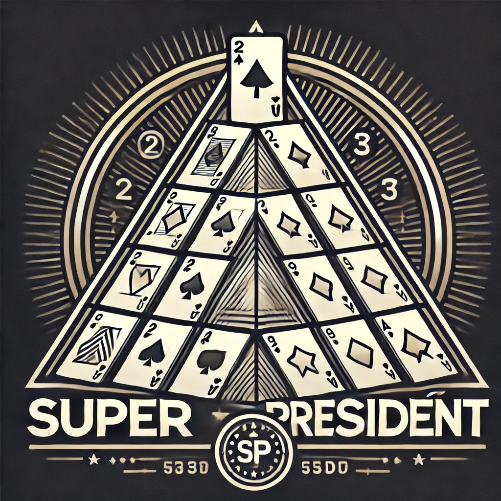

# Proposition E : Les Quatre Joueurs (Favori 2)
## Description Détaillée du Logo :
1. Ambiance Générale

   Thème : Le logo met en avant quatre silhouettes de joueurs autour d’une table, symbolisant la convivialité et l’interaction qui caractérisent le jeu de Président. L’objectif est de créer une ambiance amicale et accessible, qui reflète le plaisir de jouer ensemble.
   Style Visuel : Stylisé et moderne, avec des silhouettes colorées pour une identité visuelle dynamique. Le design conserve un aspect épuré pour une reconnaissance facile et immédiate.

2. Palette de Couleurs

   Palette Variée pour les Silhouettes : Chaque joueur a une couleur distincte, créant un effet visuel coloré et harmonieux :
   Bleu (#1E90FF) : Représentant un des joueurs.
   Vert (#32CD32) : Une autre couleur pour un joueur différent.
   Rouge (#FF4500) : Ajoute de la chaleur et de l’énergie.
   Jaune (#FFD700) : Apporte une touche lumineuse et joyeuse.
   Brun Bois (#8B4513) : Utilisé pour la table, évoquant un espace de jeu chaleureux et traditionnel.
   Blanc : Pour le fond ou pour apporter du contraste et des détails, garantissant une lisibilité optimale.

3. Symboles et Images

   Silhouettes des Joueurs :
   Design : Quatre silhouettes stylisées et épurées, sans traits de visage pour conserver une approche anonyme et universelle.
   Position : Les joueurs sont disposés autour de la table, soit vus de profil, soit en légère perspective, créant une dynamique de groupe et d’interaction.

   Table de Jeu :
   Forme : Table circulaire ou carrée, placée au centre du logo, avec des cartes posées dessus pour symboliser le jeu en cours.
   Design : Légère perspective pour ajouter de la profondeur et accentuer l’impression de table de jeu autour de laquelle les joueurs sont réunis.

   Cartes à Jouer :
   Disposition : Des cartes sont disposées sur la table, certaines face visible pour indiquer que la partie est en cours.
   Design : Simple mais reconnaissable, avec des symboles clairs (Cœur, Carreau, Trèfle, Pique) pour faire écho au jeu de cartes.

   Texte ("Super Président") :
   Position : Placé au-dessus de la scène de jeu pour un effet de titre, ou en dessous pour un ancrage visuel solide.
   Style du Texte : Police sans-serif moderne, en lettres majuscules pour une lisibilité optimale et un style contemporain.
   Couleur : Noir ou une couleur contrastante selon le fond, assurant que le texte se démarque bien du reste du logo.

4. Composition et Disposition

   Perspective Légère : Une perspective discrète est ajoutée pour donner de la profondeur, accentuant l’effet d’une scène de jeu active et vivante.
   Équilibre Visuel : La disposition centrée des silhouettes et de la table assure un équilibre visuel agréable et dynamique, renforçant l’aspect interactif.

5. Style et Détails

   Lignes et Contours : Lignes épurées et contours nets pour une lisibilité immédiate et un aspect moderne. Les silhouettes et les éléments de la table sont stylisés pour un rendu minimaliste mais impactant.
   Effets Visuels :
   Ombres Légères : Des ombres subtiles sont ajoutées pour apporter de la profondeur aux silhouettes et à la table, sans surcharger le design.
   Couleurs Harmonieuses : La palette de couleurs variée des joueurs est équilibrée pour une esthétique agréable et accueillante.

6. Fond et Versions Adaptées

   Fond Blanc : Pour un contraste clair et une présentation épurée, parfait pour des supports numériques et imprimés.
   Fond Transparent : Alternative pour une utilisation flexible sur divers supports, permettant au logo de s’adapter à différents arrière-plans.

7. Ambiance Générale

   Impression Dégagée : Le logo évoque l’interaction sociale et la convivialité du jeu de cartes "Super Président". Il invite à partager une expérience de jeu amicale et dynamique, reflétant le plaisir de jouer ensemble.
   Utilisation Prévue : Idéal pour les supports numériques comme les sites web et applications mobiles, ainsi que pour les supports imprimés destinés à promouvoir le jeu et ses valeurs interactives.

Ce logo, en rassemblant quatre silhouettes de joueurs autour d’une table, met en avant le côté social et amusant du jeu "Super Président". Sa palette de couleurs et sa composition équilibrée capturent l’essence du jeu tout en restant simple, accueillant et adaptable.

## Instructions pour DALL·E:
    Design a modern, friendly logo for 'Super Président' featuring four stylized player silhouettes gathered around a gaming table, symbolizing the social and interactive spirit of the game. The design should be colorful, simple, and instantly recognizable, conveying the enjoyment of playing together.

    Color Palette:
        Player Colors:
            Blue (#1E90FF): Representing one player.
            Green (#32CD32): Another color for a second player.
            Red (#FF4500): Adds warmth and energy.
            Yellow (#FFD700): Bright and cheerful, representing another player.
        Wood Brown (#8B4513): For the table, evoking a warm, traditional playing area.
        White: Used as a background or for contrasting details, ensuring optimal readability.

    Main Symbols and Imagery:
        Player Silhouettes:
            Design: Four clean, stylized silhouettes without facial details for a universal and inclusive look.
            Position: Arranged around the table, either in profile or with a slight perspective, creating a sense of group interaction and engagement.
        Game Table:
            Shape: Circular or square, placed centrally, with playing cards on it to indicate an ongoing game.
            Design: Slight perspective to add depth and enhance the feeling of a game in progress.
        Playing Cards:
            Placement: Cards are laid out on the table, with some face-up to show that a game is underway.
            Design: Simple but recognizable symbols (Hearts, Diamonds, Clubs, Spades) that reflect classic card game visuals.

    Text ('Super Président'):
        Position: Positioned above the game scene as a title or below for visual grounding.
        Font Style: Modern sans-serif in uppercase, such as Helvetica or Arial, for a contemporary and easily readable look.
        Color: Black or contrasting color depending on the background, ensuring that the text stands out clearly.

    Composition and Depth:
        Slight Perspective: A gentle perspective for depth, emphasizing an active and lively game scene.
        Visual Balance: The central arrangement of silhouettes and table provides a pleasing balance and reinforces the interactive element.

    Styling and Visual Details:
        Lines and Outlines: Clean, sharp outlines for instant recognition, with a modern look. The silhouettes and table elements are stylized for a minimalist yet impactful appearance.
        Visual Effects:
            Subtle Shadows: Light shadows for depth on silhouettes and table, without overloading the design.
            Harmonious Colors: Balanced palette for player colors, creating a welcoming and aesthetically pleasing look.

    Background and Alternate Versions:
        White Background: For a clean, clear presentation that highlights the vibrant player colors and card symbols.
        Transparent Background: Alternate option for flexible use on different backgrounds, allowing adaptability across various media.

    Overall Mood and Usage:
        Atmosphere: Evokes social interaction and the friendly atmosphere of playing cards together, inviting players to enjoy a fun and dynamic experience.
        Intended Use: Suitable for digital media such as websites and mobile apps, as well as printed materials that promote the interactive and social values of the game.

    This logo captures the social essence of 'Super Président,' with a design that is simple yet welcoming, representing the enjoyment of the game in a vibrant, approachable way.

## Résultat
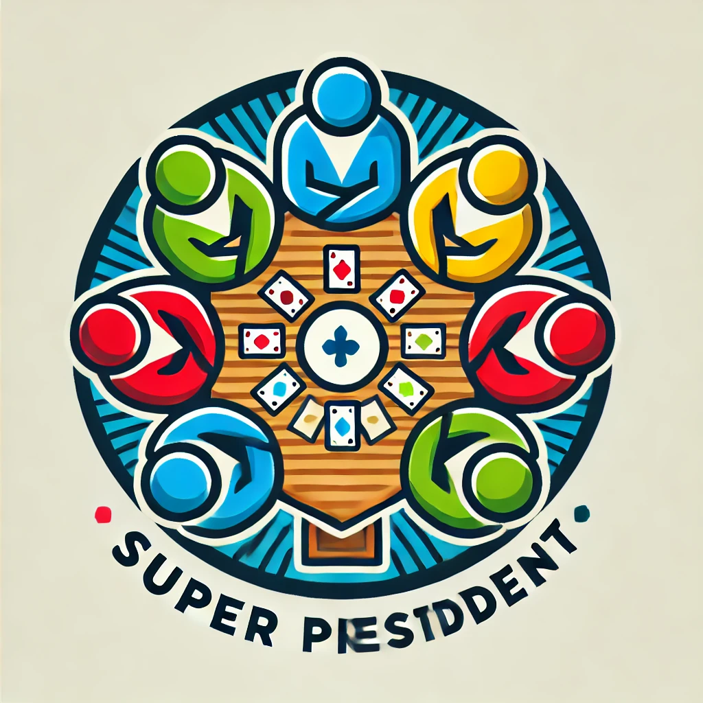

# Proposition F : Le Jeu de Cartes Animé (favori 3)
## Description Détaillée du Logo :
1. Ambiance Générale

   Thème : Le logo transforme les cartes de jeu en personnages animés et expressifs, créant une ambiance ludique et légère qui attire un public de tous âges. Chaque carte a un rôle et une personnalité unique, illustrant les différentes positions dans le jeu de Président.
   Style Visuel : Un style cartoon avec des couleurs vives et des expressions marquées, rendant chaque carte reconnaissable et sympathique.

2. Palette de Couleurs

   Couleurs Vives et Contrastées :
   Rouge Vif, Noir, Blanc : Utilisés pour les cartes elles-mêmes, respectant les couleurs classiques des jeux de cartes tout en ajoutant une touche de vivacité.
   Couleurs Variées pour les Accessoires : Des touches de couleurs diverses pour les accessoires et les expressions des cartes, ajoutant de la personnalité à chaque personnage.

3. Symboles et Images

   Cartes Personnifiées :
   As avec une Couronne :
   Représente le Président, avec une expression confiante ou fière, symbolisant l’autorité.
   Porte une couronne dorée, soulignant son statut de leader.
   Roi avec un Insigne :
   Représente le Vice-Président, arborant un insigne ou une médaille pour montrer son rôle de second.
   Expression bienveillante ou solidaire, reflétant son rang élevé mais subordonné.
   2 Triste ou Humoristique :
   Représente le Trouduc, avec une expression comique ou boudeuse.
   Porte un accessoire humoristique, comme un bonnet d'âne ou une moue exagérée pour renforcer son statut de joueur en bas de la hiérarchie.

   Interaction entre les Cartes :
   Les cartes sont disposées pour interagir entre elles, par exemple, le Président regardant le Trouduc avec une expression indulgente, tandis que le Roi se tient proche du Président pour indiquer leur alliance.
   La disposition des cartes crée une scène de jeu amusante et dynamique, illustrant la hiérarchie et l’humour du jeu.

   Texte ("Super Président") :
   Position : Placé en haut ou en bas de la scène pour encadrer les personnages-cartes.
   Style du Texte : Police ludique et arrondie, en lettres majuscules ou minuscules pour un aspect convivial et accessible.
   Couleur : Une couleur vive qui contraste avec le fond, pour que le texte reste facilement lisible et complémentaire au design cartoon.

4. Composition et Disposition

   Orientation : Principalement horizontal ou carré, avec les personnages-cartes alignés ou regroupés de manière symétrique.
   Équilibre Visuel : Les cartes-personnages sont disposées pour créer une scène équilibrée et amusante, les expressions et les positions contribuant à une dynamique visuelle engageante.

5. Style et Détails

   Lignes et Contours : Style cartoon avec des contours épais et des lignes nettes, soulignant chaque personnage pour une clarté immédiate.
   Effets Visuels :
   Expressions Faciales : Chaque carte a un visage expressif, montrant des émotions qui renforcent leur rôle (fierté pour le Président, comique pour le Trouduc, etc.).
   Accessoires : Chaque personnage-carte est accessoirisé pour ajouter du caractère et renforcer son identité (couronne pour le Président, insigne pour le Vice-Président, etc.).

6. Fond et Versions Adaptées

   Fond Uni : Couleur vive ou pastel, comme un bleu clair ou un jaune doux, pour donner un look moderne et joyeux tout en contrastant avec les personnages.
   Fond Transparent : Option alternative pour une utilisation sur divers supports, permettant au logo de s’adapter à différents arrière-plans.

7. Ambiance Générale

   Impression Dégagée : Ce logo vise à être amusant, accueillant, et dynamique. Il attire un public large, des familles aux jeunes joueurs, en rendant chaque carte identifiable et attachante grâce à ses accessoires et ses expressions.
   Utilisation Prévue : Parfait pour les supports numériques et imprimés, tels que les sites web, applications mobiles, affiches promotionnelles, et autres supports visant à capter l’attention et communiquer le caractère social et léger du jeu.

Ce logo, avec ses cartes à jouer animées et personnifiées, capture l’essence ludique et interactive de "Super Président". En combinant un style cartoon avec des accessoires amusants et des expressions marquées, il reflète l’humour et la hiérarchie du jeu, tout en restant visuellement accessible et mémorable.

## Instructions pour DALL·E:
    Create a playful, cartoon-style logo for 'Super Président' featuring personified playing cards with unique expressions and accessories, representing the different roles in the game hierarchy. The design should be lively and accessible to all ages, with each card character having a distinct personality and vivid colors.

    Color Palette:
        Vibrant Red, Black, and White: Used for the cards themselves, respecting traditional card colors but with added brightness.
        Various Accessory Colors: Each card has accessory colors, such as gold for a crown or silver for a badge, adding character to each personality.

    Main Symbols and Imagery:

        Personified Cards:
            Ace with a Crown:
                Represents the President, with a proud or confident expression symbolizing authority.
                Wears a golden crown to emphasize leadership.
            King with an Insignia:
                Represents the Vice-President, wearing a badge or medal to show his supportive, high-ranking role.
                Has a friendly or cooperative expression to reflect his secondary rank.
            2 with a Humorous Expression:
                Represents the Trouduc, with a comical or sulky face.
                Wears a humorous accessory, like a dunce cap or exaggerated frown, to reinforce his lower rank.

        Interaction Between Cards:
            The cards are arranged to interact; for example, the President looks down at the Trouduc with a tolerant expression, while the Vice-President stands close by to show their alliance.
            The arrangement creates a fun, dynamic scene that highlights the hierarchy and humor of the game.

    Text ('Super Président'):
        Position: Placed above or below the scene, framing the character cards.
        Font Style: Rounded, playful font, in uppercase or lowercase for an inviting, accessible feel.
        Color: A bright color that contrasts with the background, ensuring the text is easily readable and complements the cartoon style.

    Composition and Layout:
        Orientation: Primarily horizontal or square, with the character cards arranged symmetrically or in a balanced grouping.
        Visual Balance: The character cards create an engaging and well-balanced scene, with their expressions and positions adding visual interest and humor.

    Styling and Visual Details:
        Lines and Outlines: Thick, clean cartoon outlines to emphasize each character and ensure clarity.
        Visual Effects:
            Facial Expressions: Each card has a distinct, expressive face that reinforces its role (pride for the President, humor for the Trouduc, etc.).
            Accessories: Each character card is accessorized to enhance its personality (crown for the President, badge for the Vice-President).

    Background and Alternate Versions:
        Solid Background: A vibrant or pastel color, like light blue or soft yellow, for a modern, cheerful look that contrasts well with the character colors.
        Transparent Background: For flexible use on various media and backgrounds.

    Overall Mood and Intended Use:
        Atmosphere: The logo should feel fun, friendly, and dynamic, appealing to a wide audience from families to younger players by making each card character charming and memorable.
        Intended Use: Ideal for digital and print media, including websites, mobile apps, promotional posters, and other media meant to capture attention and convey the social, lighthearted nature of the game.

    This logo brings the lighthearted, interactive nature of 'Super Président' to life with animated, accessorized cards that embody the game’s humor and hierarchy, making it visually appealing and easy to recognize.

## Résultat
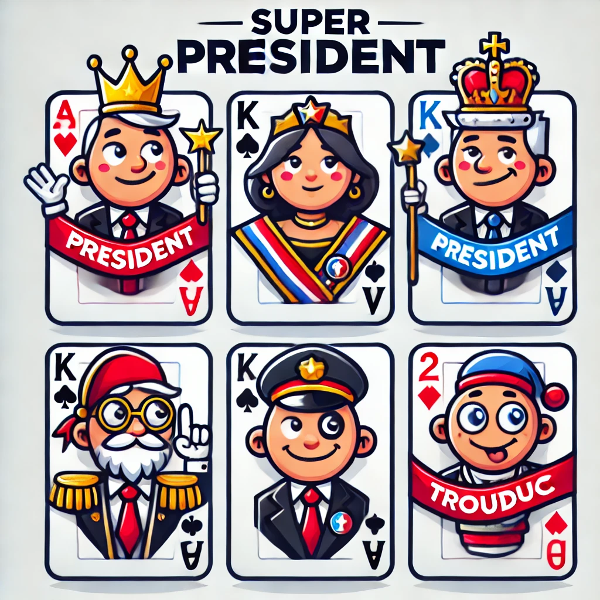

# Proposition G : Le Symbole du Président
## Description Détaillée du Logo
1. Ambiance Générale

   Thème : Le logo associe une carte à jouer avec des éléments présidentiels pour symboliser le prestige et l’autorité du titre de Président dans le jeu. L’esthétique du logo met en avant le caractère prestigieux et compétitif du jeu tout en rappelant l’univers des cartes.
   Style Visuel : Élégant et raffiné, avec un design centré sur la verticalité de la carte et les détails dorés du sceau présidentiel.

2. Palette de Couleurs

   Doré Métallique (#FFD700) : Utilisé pour le sceau présidentiel, renforçant l’impression de luxe et de prestige.
   Rouge et Noir : Pour les symboles de la carte (cœur ou pique), qui ajoutent un contraste classique au design.
   Blanc : Employé pour le fond ou pour créer des contrastes nets qui rehaussent les détails du logo.

3. Symboles et Images

   Carte avec Sceau Présidentiel :
   Carte Représentée :
   La carte choisie est un As, de pique ou de cœur, pour représenter un rang élevé et marquer le statut de Président.
   Sceau Présidentiel :
   Estampillé au centre de la carte pour en faire l’élément principal, ce sceau intègre des symboles traditionnels de pouvoir et de prestige, tels que :
   Aigle Stylisé : Symbole universel de puissance et d’autorité.
   Étoiles : Positionnées autour de l’aigle pour représenter la grandeur et l’excellence.
   Branches de Laurier : Encerclant ou intégrées dans le sceau, elles symbolisent la victoire et le respect.
   Design du Sceau : En doré métallique avec des détails fins, le sceau est dessiné avec précision pour donner un effet de relief et de brillance qui attire l'œil.

   Texte ("Super Président") :
   Position : Inscrit sous la carte pour un effet de titre, servant de base visuelle au design.
   Style du Texte : Police serif élégante et raffinée en lettres majuscules, renforçant l’aspect officiel du logo.
   Couleur : Doré ou noir selon le fond, garantissant une lisibilité parfaite et s’harmonisant avec les éléments dorés du sceau.

4. Composition et Disposition

   Orientation : La carte est positionnée verticalement au centre du logo, créant une composition visuellement équilibrée et ancrée.
   Éléments Centraux : Le sceau présidentiel occupe le centre de la carte, focalisant l’attention et symbolisant la hiérarchie du jeu.

5. Style et Détails

   Lignes et Contours : Des détails précis et raffinés sont intégrés au sceau et à la carte pour un effet haut de gamme. Les contours de la carte sont nets et minimalistes pour garder une élégance sobre.
   Effets Visuels :
   Relief et Ombres : Des ombres subtiles ajoutent de la profondeur au sceau, créant un effet 3D qui renforce l’aspect luxueux du logo.
   Brillance Métallique : Des reflets dorés apportent une brillance subtile au sceau, rappelant l’éclat du métal précieux sans être trop clinquant.

6. Fond et Versions Adaptées

   Fond Blanc : Permet de mettre en valeur le doré du sceau et les couleurs de la carte, offrant un contraste clair et net.
   Fond Transparent : Option alternative pour une utilisation polyvalente sur différents supports, assurant que le logo reste impactant quel que soit l’arrière-plan.

7. Ambiance Générale

   Impression Dégagée : Ce logo évoque le prestige, le pouvoir et la connexion avec le monde des cartes. Il capture l’essence de "Super Président" en combinant des éléments de hiérarchie et de respect propres au titre de Président dans le jeu.
   Utilisation Prévue : Idéal pour les supports numériques et imprimés, tels que les sites web, les applications, les affiches et tout autre support promotionnel où l’on souhaite renforcer l’aspect compétitif et prestigieux du jeu.

Ce logo, avec sa carte ornée d’un sceau présidentiel, associe habilement les éléments du jeu de cartes et de l’autorité présidentielle. Son design élégant et centré donne une impression de sérieux et de raffinement, tout en soulignant l’importance du titre dans le jeu "Super Président".

## Instructions pour DALL·E:
    Design a refined, elegant logo for 'Super Président' featuring a single playing card with presidential symbols to represent the prestigious rank of President in the game. The logo should blend the classic world of card games with the authority of a presidential seal, using a vertical design with luxurious gold details.

    Color Palette:
        Metallic Gold (#FFD700): For the presidential seal, symbolizing luxury and prestige.
        Red and Black: Used for the card symbols (Heart or Spade), adding classic contrast to the design.
        White: As the background or for sharp contrasts to enhance detail clarity.

    Main Symbols and Imagery:
        Playing Card with Presidential Seal:
            Card Selection: An Ace, either of Hearts or Spades, representing a high rank and the President’s status.
            Presidential Seal:
                Center Placement: Positioned in the center of the card as the primary focus, featuring classic symbols of power such as:
                    Stylized Eagle: Universal emblem of strength and authority.
                    Stars: Arranged around the eagle to signify grandeur and excellence.
                    Laurel Branches: Encircling or integrated within the seal, symbolizing victory and respect.
                Seal Design: In metallic gold with intricate detailing, crafted with precision for a 3D effect and subtle shine that draws the eye.

    Text ('Super Président'):
        Position: Placed beneath the card, acting as a title and providing a visual base for the design.
        Font Style: Elegant serif typeface in uppercase, reinforcing the formal, prestigious feel of the logo.
        Color: Gold or black depending on background, ensuring perfect readability and harmony with the golden seal.

    Composition and Layout:
        Orientation: The card is vertically centered in the logo, creating a visually balanced, anchored composition.
        Central Focus: The presidential seal dominates the center of the card, capturing attention and symbolizing the game’s hierarchy.

    Styling and Visual Details:
        Lines and Outlines: Precise, refined details on the seal and card edges for a premium effect. The card edges are clean and minimal for a sophisticated look.
        Visual Effects:
            Subtle Relief and Shadows: Light shadowing around the seal to add depth and a 3D effect, enhancing the luxurious appearance.
            Metallic Shine: Subtle golden reflections on the seal to emulate the look of precious metal without excessive gloss.

    Background and Alternate Versions:
        White Background: To highlight the gold seal and card colors, providing a crisp, clear contrast.
        Transparent Background: For versatile use across different media, ensuring the logo remains impactful on any background.

    Overall Mood and Intended Use:
        Atmosphere: Conveys prestige, authority, and the essence of card games. The logo embodies 'Super Président' by combining hierarchy and respect associated with the President’s rank.
        Intended Use: Suitable for digital and print media, including websites, apps, posters, and promotional materials where the competitive, prestigious nature of the game needs to stand out.

    This logo captures the essence of 'Super Président' with a card and presidential seal, combining the elegance and authority of the title in a centered, refined design.

## Résultat
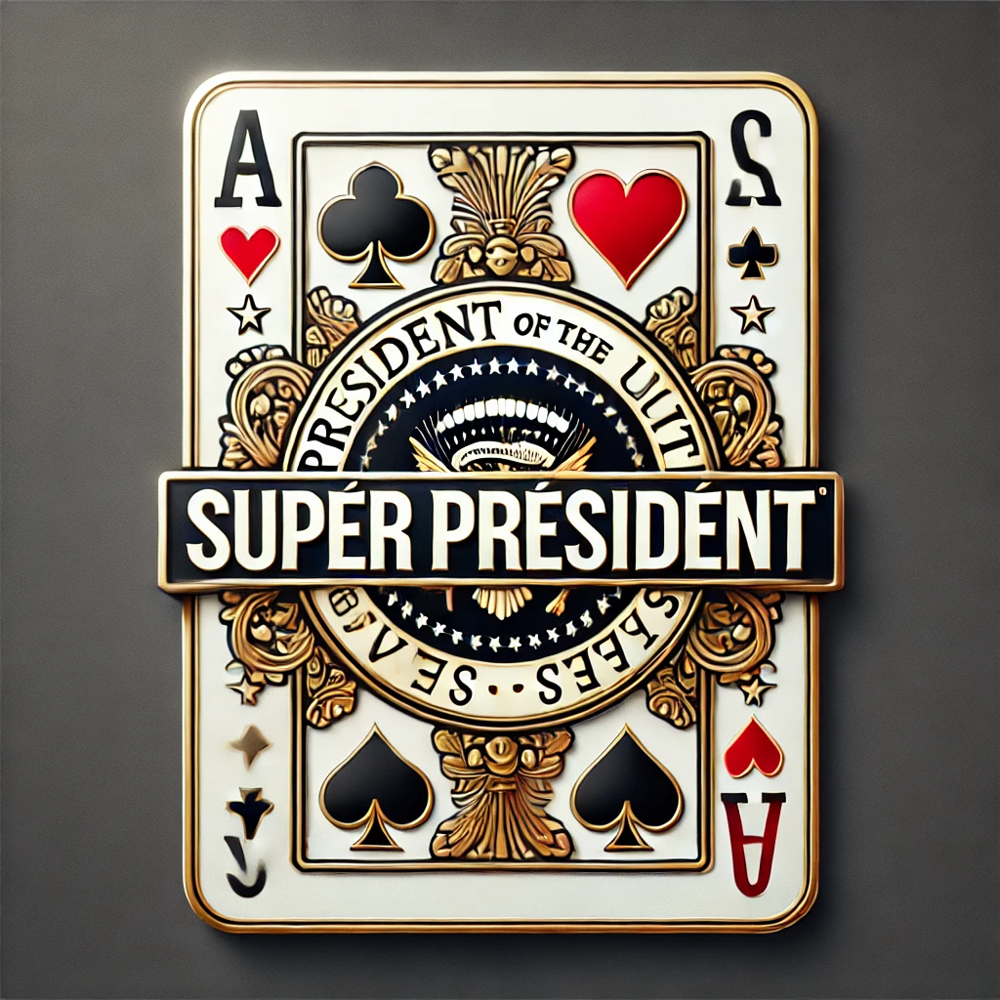

