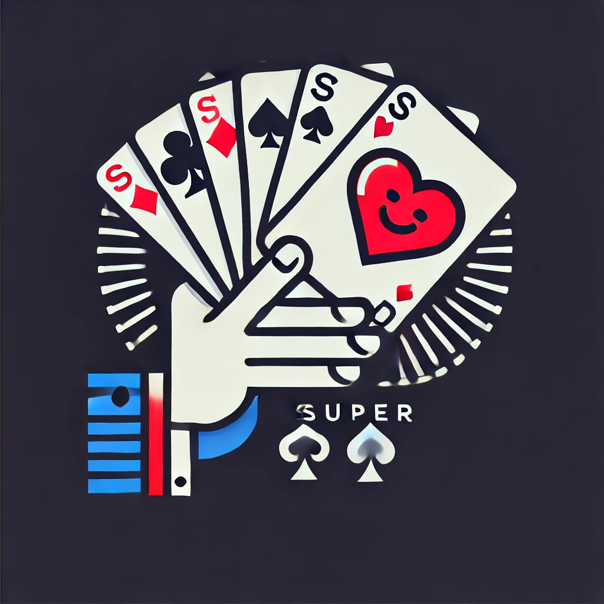

# Description 1
[Proposition C : Les Cartes en Éventail (Favori)](/idea/logo.md#proposition-c--les-cartes-en-Éventail-favori)

# Retravail de l'expext
## 1
### Description Détaillée du Logo
Ambiance Générale

    Thème : Le logo met en avant une main stylisée tenant un éventail de cartes, symbolisant la maîtrise, la stratégie et l'interaction sociale du jeu de Président. Il capture l'essence du jeu en mettant en avant le geste emblématique du joueur.

    Style Visuel : Moderne avec une touche ludique, utilisant des lignes nettes et des formes géométriques simples. Le style flat design est privilégié pour assurer une excellente lisibilité sur les écrans et une adaptabilité sur différents supports.

Palette de Couleurs

    Rouge Vif (#FF0000) : Utilisé pour les symboles de Cœur et de Carreau, apportant de la chaleur, de l'énergie et attirant l'œil.

    Noir Profond (#000000) : Employé pour les symboles de Trèfle et de Pique, créant un contraste classique et élégant avec le rouge.

    Gris Foncé (#333333) : Utilisé pour les contours, les ombres et la main stylisée, ajoutant de la profondeur tout en maintenant une cohérence visuelle.

    Blanc Pur (#FFFFFF) : Servant de fond principal, assurant une clarté et une lisibilité optimales, et permettant aux autres couleurs de ressortir.

Typographie

    Police : Utilisation d'une police sans-serif moderne avec du caractère, comme Montserrat, Gotham ou Raleway, pour apporter une touche unique et professionnelle.

    Style du Texte :

        Le texte "SUPER PRÉSIDENT" est en majuscules pour une meilleure lisibilité et un impact visuel fort.

        Hiérarchie Visuelle : Le mot "SUPER" est légèrement plus grand ou plus épais que "PRÉSIDENT" pour mettre en avant l'aspect exceptionnel du jeu.

    Couleur du Texte : Noir Profond ou Rouge Vif, selon le fond, pour garantir un contraste optimal et une lisibilité accrue.

Symboles et Images
Main Stylisée

    Design : La main est simplifiée avec des formes géométriques épurées, utilisant des contours nets et minimalistes. Les doigts sont représentés de manière stylisée pour faciliter la reconnaissance tout en restant abstraits.

    Position : Située sur le côté gauche du logo, la main tient l'éventail de cartes de manière naturelle, légèrement inclinée vers le haut pour ajouter du dynamisme.

Éventail de Cartes

    Cartes Représentées :

        Inclut des cartes clés du jeu Président, comme le 2, le 3 et l'As.

        Les symboles de Cœur, Carreau, Trèfle et Pique sont simplifiés en icônes claires et facilement identifiables.

    Disposition :

        Les cartes sont étalées en éventail avec les faces avant visibles.

        Les symboles et les valeurs sont suffisamment grands pour être lisibles même en petite taille.

    Design des Cartes :

        Style flat design avec des couleurs vives et des formes simples.

        Absence de détails complexes pour maintenir la clarté visuelle.

Composition et Disposition

    Orientation Horizontale :

        La main et l'éventail de cartes sont placés sur le côté gauche.

        Le texte "SUPER PRÉSIDENT" est aligné à droite, créant un équilibre visuel harmonieux.

    Version Verticale :
        Pour les supports où l'espace horizontal est limité, le logo peut être réorganisé avec l'éventail de cartes au-dessus du texte.

Style et Détails

    Lignes et Contours :

        Utilisation de lignes propres et précises.

        Les contours sont réalisés en gris foncé pour un contraste doux sans être trop prononcé.

    Effets Visuels :

        Flat Design : Pas d'ombres portées ni de dégradés pour une apparence moderne et épurée.

        Éléments Ludiques : Ajout subtil d'éclats ou de petits motifs autour des cartes pour suggérer le dynamisme et le plaisir du jeu.

Fond et Versions Adaptées

    Fond Blanc :

        Offre un look propre et moderne.

        Met en valeur les couleurs vives et assure une lisibilité maximale.

    Fond Transparent :
        Permet une utilisation polyvalente sur divers supports et fonds colorés.

    Versions Monochromes :

        Création de versions en noir et blanc ou en niveaux de gris pour les applications où la couleur n'est pas possible.

        Le design reste reconnaissable et conserve son impact visuel.

Ambiance Générale

    Impression Dégagée :

        Le logo évoque la stratégie, la maîtrise du jeu et l'interaction sociale.

        L'aspect dynamique et engageant incite les joueurs à participer et à s'investir dans le jeu.

    Utilisation Prévue :

        Adapté aux supports numériques comme les sites web et applications mobiles grâce à sa conception responsive.

        Convient également aux supports imprimés pour les événements, les promotions et les articles de merchandising liés au jeu.

Adaptabilité et Tests Visuels

    Responsive Design :
        Le logo est conçu pour être clair et identifiable même à petite échelle, idéal pour une utilisation sur les appareils mobiles.

    Tests sur Différents Supports :
        Vérification de l'impact visuel du logo sur divers fonds et matériaux, comme le papier, le textile ou les surfaces numériques.

    Feedback Utilisateur :
        Intégration des retours du public cible pour s'assurer que le logo communique efficacement les valeurs du jeu.

### Instructions pour DALL·E
    Design a modern, playful logo for 'Super Président' featuring a stylized hand holding a fan of playing cards, symbolizing mastery, strategy, and social interaction in the game. The design should have a flat, clean aesthetic with simple geometric shapes for clarity across digital and printed media.

    Color Palette:
        Bright Red (#FF0000): For the Heart and Diamond symbols, adding warmth, energy, and visual attraction.
        Deep Black (#000000): For the Club and Spade symbols, creating an elegant contrast with the red.
        Dark Gray (#333333): Used for contours, shadows, and the stylized hand, adding subtle depth and visual consistency.
        Pure White (#FFFFFF): Main background color to ensure clarity and make other colors stand out.

    Typography:
        Font: Use a modern sans-serif font like Montserrat, Gotham, or Raleway for a unique, professional touch.
        Text Style:
            "SUPER PRÉSIDENT" in uppercase for readability and strong visual impact.
            Visual Hierarchy: "SUPER" is slightly larger or bolder than "PRÉSIDENT" to emphasize the game's exceptional aspect.
        Text Color: Deep Black or Bright Red for optimal contrast and readability depending on the background.

    Main Symbols and Imagery:
        Stylized Hand:
            Design: Simple, geometric shapes for a minimalist look, with clean contours; fingers represented in an abstract form for easy recognition.
            Position: Positioned on the left, naturally holding the fan of cards at a slight upward angle for dynamism.
        Fan of Cards:
            Cards Represented:
                Includes key cards from the game, such as the 2, 3, and Ace.
                Symbols of Heart, Diamond, Club, and Spade are simplified into clear, recognizable icons.
            Arrangement: Cards are fanned out with visible faces, showcasing symbols and values in a way that is readable even at smaller sizes.
            Card Design: Flat design with vibrant colors and simple shapes, avoiding intricate details to maintain clarity.

    Composition and Layout:
        Horizontal Orientation:
            Hand and card fan on the left side.
            "SUPER PRÉSIDENT" text aligned on the right, creating balanced visual harmony.
        Vertical Version: For limited horizontal space, the logo can be arranged with the fan of cards above the text.

    Styling and Visual Details:
        Lines and Contours: Clean, precise lines with a dark gray outline for a soft contrast.
        Visual Effects:
            Flat Design: No shadows or gradients for a modern, polished look.
            Playful Elements: Subtle sparkles or small motifs around the cards to suggest the fun and dynamic nature of the game.

    Background and Alternate Versions:
        White Background: Offers a clean, modern look, highlighting the vibrant colors for maximum legibility.
        Transparent Background: Alternative for flexible use on different media and colored backgrounds.
        Monochrome Versions: Black-and-white or grayscale versions for applications without color, retaining recognizability and visual impact.

    Overall Mood and Intended Use:
        Atmosphere: Conveys strategy, control, and social interaction, with an inviting, dynamic feel that encourages player engagement.
        Intended Use: Ideal for digital platforms like websites and mobile apps, and also suitable for printed materials promoting events, merchandise, or game-related marketing.

    Adaptability and Testing:
        Responsive Design: Logo remains clear and recognizable at small sizes, suitable for mobile devices.
        Media Testing: Logo impact tested on various backgrounds and materials, such as paper, fabric, and digital screens.
        User Feedback: Incorporate target audience feedback to ensure the logo effectively communicates the game’s core values.

### Résultat

## 2
### Description Détaillée du Logo
1. Composition Principale

   Main Stylisée Minimaliste
   Design : Une main simplifiée avec des formes géométriques épurées, représentée par des lignes essentielles ou une silhouette. Cela suggère l'action de jouer sans surcharger le visuel.
   Position : Placée au centre ou légèrement décalée pour équilibrer avec le texte.

   Cartes Clés
   Cartes Présentées : Deux cartes croisées ou légèrement en éventail, mettant en avant les cartes de rang 2 et 3, qui sont centrales dans les règles de votre jeu.
   Symboles sur les Cartes : Les enseignes de Cœur et Pique peuvent être utilisées pour ajouter du contraste, stylisées de manière minimaliste.
   Élément de Révolution : Une flèche circulaire subtile entourant les cartes, symbolisant la règle de la Révolution.

2. Typographie

   Police Moderne Sans-Serif
   Choix de Police : Optez pour une police comme Montserrat, Gotham ou Futura pour un look contemporain et élégant.
   Style du Texte :
   Utilisez des majuscules pour le texte "SUPER PRÉSIDENT" pour un impact visuel fort.
   Espacement : Légèrement augmenté entre les lettres pour accentuer le côté moderne.
   Position du Texte : Placé sous le symbole principal ou à droite, en fonction de la composition.

   Couleur du Texte
   Noir Profond (#000000) ou Gris Foncé (#333333) pour un contraste net sur fond clair.
   Accentuation : Possibilité d'utiliser le Rouge Vif (#FF0000) pour souligner un mot ou une lettre spécifique.

3. Palette de Couleurs

   Couleurs Simples et Contrastées
   Noir et Blanc : Base du logo pour une apparence épurée et intemporelle.
   Rouge Vif : Utilisé avec parcimonie pour attirer l'attention sur les éléments clés, comme les numéros des cartes ou un détail dans le texte.
   Bichromie : Limiter la palette de couleurs pour renforcer l'aspect minimaliste et faciliter la reproduction sur différents supports.

4. Symboles et Icônes

   Éléments Simples et Reconnaissables
   Flèche Circulaire : Représentation stylisée de la Révolution, entourant les cartes ou intégrée discrètement dans le design.
   Symboles des Enseignes : Icônes minimalistes pour les enseignes de Cœur et Pique, éventuellement intégrées dans les cartes.

5. Style Général

   Flat Design
   Sans Ombres ni Dégradés : Utilisation de couleurs unies pour un rendu moderne et une meilleure lisibilité sur les écrans.
   Formes Géométriques : Privilégier les lignes droites et les courbes simples pour une esthétique nette.

   Espaces Négatifs
   Utilisation Créative de l'Espace : Exploiter les zones vides pour suggérer des formes ou des symboles, ajoutant de la profondeur sans complexité supplémentaire.

6. Adaptabilité

   Version Icône
   Simplification Maximale : Une version encore plus minimaliste pour les favicons, applications mobiles ou avatars, en conservant un élément clé comme les deux cartes croisées.
   Lisibilité : S'assurer que le logo reste identifiable même en très petite taille.

   Variantes de Couleurs
   Monochrome : Prévoir des versions en noir ou blanc uniquement pour les utilisations où la couleur est limitée.
   Inversion : Le logo doit être efficace sur des fonds clairs et foncés.

7. Exemples Concrets de Mise en Page

    Option 1 : Main et Cartes Centrés 
    Main Simplifiée : Placée au centre tenant deux cartes légèrement décalées.
    Cartes de Rang 2 et 3 : Les numéros 2 et 3 sont bien visibles, avec des symboles de Cœur et Pique stylisés.
    Flèche Circulaire Subtile : Entourant partiellement les cartes pour symboliser la Révolution sans alourdir le design.
    Texte "SUPER PRÉSIDENT" : Placé en dessous, centré, avec une police moderne et un espacement soigné.

    Option 2 : Cartes Croisées Sans Main
    Deux Cartes Croisées : Formant un "X", symbolisant la confrontation et la compétition.
    Numéros et Enseignes : Les cartes affichent les numéros 2 et 3, avec des enseignes stylisées.
    Élément Graphique Minimal : Une fine ligne ou flèche suggérant la Révolution ou le Reverse.
    Texte : Positionné soit en dessous soit à droite des cartes, aligné de manière harmonieuse.

8. Étapes pour la Réalisation

   Esquisses Préliminaires
   Commencez par dessiner des croquis rapides pour explorer les différentes compositions.
   Jouez avec la disposition des éléments pour trouver le meilleur équilibre visuel.

   Sélection des Éléments Clés
   Décidez si la main est nécessaire ou si les cartes seules suffisent pour représenter le jeu.
   Choisissez les symboles qui reflètent le mieux les règles spéciales (Révolution, Reverse).

   Choix de la Police
   Testez plusieurs polices modernes pour voir laquelle correspond le mieux à l'identité du jeu.
   Expérimentez avec la taille, le poids et l'espacement des lettres.

   Définition de la Palette de Couleurs
   Limitez-vous à 2 ou 3 couleurs pour maintenir la simplicité.
   Assurez-vous que les couleurs choisies offrent un bon contraste et sont cohérentes avec l'image du jeu.

   Création Numérique
   Utilisez un logiciel de design vectoriel (comme Adobe Illustrator, Sketch ou Inkscape) pour réaliser le logo.
   Créez des versions en couleur et monochromes pour différentes utilisations.

   Vérification de l'Adaptabilité
   Testez le logo à différentes tailles pour vous assurer qu'il reste lisible et reconnaissable.
   Appliquez-le sur différents supports (site web, application mobile, impression) pour vérifier son rendu.

   Recueil de Feedback
   Partagez le logo avec des membres de votre équipe ou des joueurs potentiels pour obtenir des avis.
   Soyez ouvert aux suggestions et prêt à apporter des ajustements si nécessaire.

9. Conseils Supplémentaires

   Cohérence Visuelle
   Maintenez une cohérence entre le logo et le design général de votre jeu (interface, couleurs, typographie).
   Cela renforcera l'identité de votre marque et améliorera l'expérience utilisateur.

   Simplicité et Impact
   N'hésitez pas à éliminer les éléments superflus pour garder le logo aussi épuré que possible.
   Un design simple est souvent plus mémorable et polyvalent.

   Symbolisme Subtil
   Intégrez les références aux règles spéciales de manière discrète pour intriguer les joueurs sans surcharger le design.
   Cela peut susciter la curiosité et encourager les gens à en savoir plus sur le jeu.

10. Conclusion

    En choisissant un logo moderne et épuré, vous misez sur un design qui traverse le temps et s'adapte facilement à divers supports. Ce style mettra en avant les aspects uniques de votre jeu Super Président tout en offrant une esthétique claire et professionnelle.
    N'hésitez pas à me faire part de vos impressions sur cette proposition ou si vous avez besoin d'aide pour la mise en œuvre concrète du logo. Je suis là pour vous accompagner jusqu'à ce que vous soyez entièrement satisfait du résultat final.

### Instructions pour DALL·E
    Design a modern, minimalist logo for 'Super Président' that features a stylized hand holding two key playing cards to represent mastery, strategy, and social interaction. The design should be flat, with clean lines and simple geometric shapes for readability on various media.

    Main Composition:
        Stylized Hand:
            Design: A simplified hand using essential lines or a silhouette, suggesting the action of playing without overwhelming detail.
            Position: Centered or slightly offset for balance with the text.
        Key Cards:
            Cards Displayed: Two crossed or slightly fanned cards, showing the numbers 2 and 3 as central to the game’s rules.
            Card Symbols: Minimalist Heart and Spade icons for contrast, designed in a clean, modern style.
        Revolution Element:
            Circular Arrow: A subtle circular arrow around the cards, symbolizing the Revolution rule, adding a strategic layer to the design.

    Typography:

        Modern Sans-Serif Font: Fonts like Montserrat, Gotham, or Futura for a contemporary and professional look.

        Text Style:
            "SUPER PRÉSIDENT" in uppercase for strong visual impact.
            Letter Spacing: Slightly increased to enhance the modern feel.
            Text Placement: Below the main symbol or to the right, depending on the layout.

        Text Color: Deep Black (#000000) or Dark Gray (#333333) for a sharp contrast on a light background.

        Accent Option: A Bright Red (#FF0000) highlight on one word or letter for emphasis.

    Color Palette:
        Simple and Contrasting Colors:
            Black and White: Base colors for a clean, timeless look.
            Bright Red: Sparingly used to draw attention to key details, like card numbers or a part of the text.
            Bichrome Design: Minimal color use to enhance the logo’s adaptability across different formats.

    Symbols and Icons:
        Simple, Recognizable Elements:
            Circular Arrow: A stylized arrow around or near the cards, subtly representing the Revolution rule.
            Suit Symbols: Minimalist icons for Heart and Spade suits, integrated into the card designs.

    Overall Style:
        Flat Design:
            No Shadows or Gradients: Solid colors for a modern, screen-friendly look.
            Geometric Shapes: Clean lines and simple curves for a sharp aesthetic.
        Creative Negative Space:
            Use of Empty Areas: Exploit negative space to subtly suggest shapes or symbols, adding depth without complexity.

    Adaptability:
        Icon Version:
            Maximum Simplification: An even more minimal design for small-scale uses, such as favicons or mobile apps, retaining only key elements like the two crossed cards.
        Monochrome Variants:
            Black or white versions for scenarios where color is restricted.
            Ensure effectiveness on both light and dark backgrounds.

    Layout Options:

        Option 1: Centered Hand and Cards:
            Hand Holding Cards: Simplified hand holding two slightly angled cards.
            Visible Numbers 2 and 3: Numbers are bold with Heart and Spade symbols.
            Circular Arrow: Subtle arrow wrapping partially around the cards, symbolizing the Revolution rule.
            Text 'SUPER PRÉSIDENT': Below the icon, centered, in a modern font with ample letter spacing.

        Option 2: Crossed Cards without Hand:
            Two Crossed Cards: Forming an 'X' for a sense of competition and hierarchy.
            Number and Suit Symbols: Displaying 2 and 3 with simple Heart and Spade icons.
            Minimal Graphic Element: A thin line or arrow to hint at the Revolution rule.
            Text Position: Either below or to the right, aligned harmoniously with the cards.

    Execution Steps:
        Preliminary Sketches: Quick sketches to explore the best compositions and balance.
        Select Key Elements: Decide whether the hand is essential or if the crossed cards alone convey the game effectively.
        Font Testing: Experiment with different modern fonts to match the game’s identity.
        Color Selection: Limit to 2-3 colors for simplicity and optimal contrast.
        Vector Creation: Use vector design software (e.g., Adobe Illustrator, Sketch, or Inkscape) to create the logo.
        Adaptability Testing: Verify readability and recognizability at different sizes.
        User Feedback: Gather opinions from the target audience to ensure clarity and engagement.

    Additional Tips:
        Visual Consistency: Align the logo style with the overall game design (interface, colors, typography) for a unified brand identity.
        Simplicity and Impact: Remove unnecessary elements to maintain a clear, memorable design.
        Subtle Symbolism: Integrate references to game rules to intrigue players without overloading the design.

    This logo design should communicate mastery, strategy, and interaction through a simple, impactful aesthetic, adaptable for both digital and print media.

### Résultat

## 3
### Description Détaillée du Logo
1. Ambiance Générale

   Thème : Le logo met en avant un éventail de cartes tenu par une main stylisée, symbolisant la stratégie, la maîtrise et l'interaction dans le jeu de Super President. L'objectif est de représenter l'essence du jeu de manière simple et percutante, en mettant en avant le geste emblématique de la main tenant les cartes.

   Style Visuel : Moderne et minimaliste, utilisant des lignes nettes et épurées avec une palette de couleurs limitée pour attirer l'œil et rendre le design facilement reconnaissable.

2. Palette de Couleurs

   Rouge Vif (#FF0000) : Utilisé pour les symboles de Cœur et de Carreau, apportant de la chaleur et de l'énergie au design.

   Noir Profond (#000000) : Couleur pour les symboles de Trèfle et de Pique, ainsi que pour le texte, créant un contraste classique avec le rouge.

   Blanc Pur (#FFFFFF) : Servant de couleur de fond, assurant une clarté et une lisibilité optimales.

   Teinte Neutre Stylisée : Pour la main, en utilisant une teinte grise claire ou une simple silhouette noire pour un rendu inclusif et universel.

3. Symboles et Images
   Main Stylisée

   Design : La main est dessinée de manière ultra-simplifiée, avec des formes géométriques basiques et sans détails complexes. Elle peut être représentée par une silhouette ou des lignes minimalistes.

   Position : Située au centre du logo, tenant l'éventail de cartes de manière naturelle, légèrement inclinée pour ajouter du dynamisme.

Éventail de Cartes

    Cartes Représentées :
        Valeurs Clés : Inclure les cartes 2 et 3, qui sont significatives dans votre jeu, pour refléter les stratégies spécifiques du Super President.

    Disposition : Les cartes sont étalées en éventail avec les faces avant visibles, mais simplifiées pour maintenir la clarté visuelle.

    Design des Cartes : Les cartes sont stylisées avec les numéros 2 et 3 clairement visibles. Les symboles des enseignes sont représentés de manière minimaliste, avec des formes claires et facilement identifiables.

Texte ("SUPER PRESIDENT")

    Position : Placé sous l'illustration de la main tenant les cartes, centré pour une lecture fluide.

    Style du Texte :

        Police : Utilisation d'une police sans-serif moderne et épurée, comme Helvetica, Arial ou Montserrat, en majuscules pour une bonne lisibilité.

        Accentuation : Pas d'accent sur "president", conformément à votre préférence.

    Couleur : Noir Profond ou Rouge Vif, selon le meilleur contraste avec le fond et pour assurer que le texte soit percutant.

4. Composition et Disposition

   Orientation Verticale : Le logo adopte une orientation verticale simple, avec l'éventail de cartes tenu par la main au-dessus et le texte "SUPER PRESIDENT" en dessous.

   Équilibre Visuel : L'éventail de cartes constitue le point focal, avec le texte positionné de manière à équilibrer l'ensemble pour une lecture facile et un impact visuel fort.

5. Style et Détails

   Lignes et Contours :

        Simplicité : Contours propres et clairs, sans détails superflus, pour un style moderne et épuré.

        Épaisseur Uniforme : Les lignes ont une épaisseur constante pour une harmonie visuelle.

   Éléments Graphiques :

        Sans Ombres ni Dégradés : Absence d'effets visuels complexes pour maintenir la clarté et faciliter la reproduction sur différents supports.

        Couleurs Vives : Le Rouge Vif est utilisé de manière stratégique pour attirer l'attention sur les éléments clés.

6. Fond et Versions Adaptées

   Fond Blanc : Pour un look propre et moderne qui permet de mettre en valeur les couleurs et les symboles du jeu.

   Fond Transparent : Option pour garantir une polyvalence sur divers supports et arrière-plans.

   Versions Monochromes :
   Noir sur Blanc et Blanc sur Noir : Pour les utilisations où la couleur n'est pas possible, tout en conservant la reconnaissance du logo.

7. Ambiance Générale

   Impression Dégagée : Le logo évoque la stratégie et la maîtrise du jeu, mettant en avant un aspect dynamique et engageant. Il invite les joueurs à prendre part activement au jeu et reflète l'essence compétitive du Super President.

   Utilisation Prévue : Convient aux supports numériques comme les sites web et applications mobiles, grâce à son design épuré et sa lisibilité à différentes tailles. Il est également adapté aux supports imprimés pour des événements, promotions et articles de merchandising liés au jeu.

### Instructions pour DALL·E
      Design a modern, minimalist logo for 'Super President' featuring a stylized hand holding a fan of playing cards, symbolizing strategy, mastery, and social interaction. The logo should be clean, visually engaging, and easy to recognize, with a limited color palette to ensure clarity.
      
      Main Composition:
        Stylized Hand:
            Design: Ultra-simplified hand with basic geometric shapes and minimal detail, represented as either a silhouette or with clean, minimalist lines.
            Position: Centered in the logo, holding the fan of cards at a slight angle for added dynamism.
        Fan of Key Cards:
            Displayed Cards: Show the numbers 2 and 3 prominently to reflect the game’s strategic elements.
            Layout: Cards fanned with faces visible, maintaining a simplified design for clarity.
            Card Design: Minimalist Heart and Spade symbols, with bold and clear numbers (2 and 3) to ensure readability.
      
      Typography:
        Font Style: Modern, sans-serif font like Helvetica, Arial, or Montserrat for a clean, contemporary look.
        Text Details:
            "SUPER PRESIDENT" in uppercase for strong readability.
            Placement: Centered below the hand and card illustration for a balanced composition.
        Text Color: Deep Black or Bright Red for high contrast and impact, chosen based on the background for optimal legibility.
      
      Color Palette:
        Bright Red (#FF0000): For Heart and Diamond symbols, adding warmth and energy.
        Deep Black (#000000): For Club and Spade symbols, as well as for text, creating a classic contrast with red.
        Pure White (#FFFFFF): As the main background color to enhance clarity and allow other colors to stand out.
        Neutral Tone for Hand: Light gray or simple black silhouette to keep it inclusive and universally recognizable.
      
      Style and Details:
        Lines and Contours:
            Simplicity: Clean, straightforward outlines with no unnecessary details.
            Uniform Thickness: Consistent line weight throughout for a harmonious visual appearance.
        Flat Design:
            No Shadows or Gradients: Solid colors only, for a modern, screen-friendly look.
            Use of Red Accents: Red is applied sparingly to key elements to draw attention without overloading the design.
      
      Background and Alternate Versions:
        White Background: Creates a clean, modern aesthetic that highlights the vivid colors and ensures high readability.
        Transparent Background: For versatile use across different media and background colors.
        Monochrome Versions:
            Black on White and White on Black: For cases where color use is limited, ensuring the logo remains recognizable.
      
      Overall Mood and Intended Use:
        Atmosphere: Conveys strategy, control, and dynamic engagement, inviting players to take part actively in the game.
        Intended Use: Suitable for digital platforms such as websites and mobile apps, and also adaptable for print media like event materials, promotions, and merchandising related to the game.

      This logo design should be visually simple yet impactful, effectively representing the essence of 'Super President' with a clean, engaging design that works across various formats.

### Résultat
